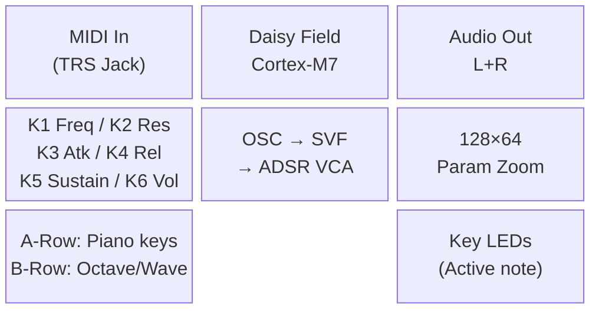
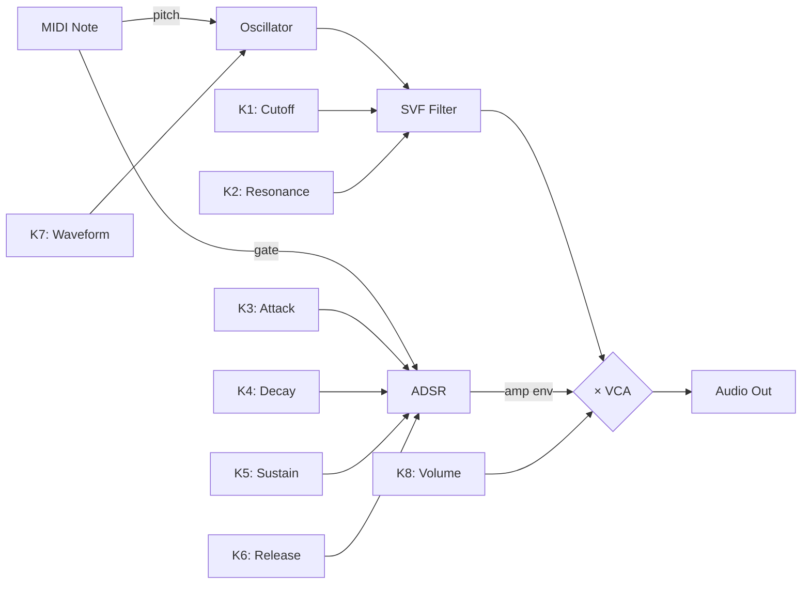
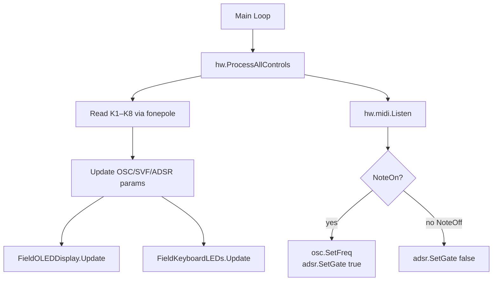

# DAISY_QAE Examples

Three complete workflow traces showing the skill in action.

---

## Example 1: Subtractive Synth on Daisy Field

**User**: "Create a mono subtractive synth for Daisy Field with MIDI input."

### STEP 1 — CONCEPT (agent produces, waits for approval)

- **Purpose**: Monophonic subtractive synthesizer with MIDI note input, SVF filter, and ADSR envelope
- **Platform**: Daisy Field
- **DaisySP modules**: `Oscillator`, `Svf`, `Adsr`
- **Foundation examples to consult**: `field1.txt` (MIDI template), `dsp/core.txt` (Oscillator, Svf, Adsr)
- **LGPL**: No
- **Complexity**: 3/10

*→ Gate 1: "Approve CONCEPT to advance to Block Diagrams?"*

---

### STEP 2 — BLOCK DIAGRAMS (agent produces all 3, waits for approval)

**A. System Architecture**


**B. Signal Flow**


**C. Control Flow**


*→ Gate 2: "Approve all 3 diagrams to advance to CONTROLS.md?"*

---

### STEP 3 — CONTROLS.md (produced, waits for approval)

```markdown
# CONTROLS — FieldMonoSynth

## Knob Mapping
| Knob | Parameter | Range  | Unit |
|------|-----------|--------|------|
| K1   | Filter Cutoff | 100–8000 | Hz |
| K2   | Resonance | 0–0.95 | — |
| K3   | Attack  | 1–500  | ms |
| K4   | Decay   | 5–1000 | ms |
| K5   | Sustain | 0–1    | — |
| K6   | Release | 5–2000 | ms |
| K7   | Waveform | Saw/Sq/Tri/Sin | — |
| K8   | Volume  | 0–1    | — |

## Keys (A-Row: Piano, B-Row: Octave/Mode)
| Key | Function | LED |
|-----|----------|-----|
| A1–A8 | Play C4–C5 (chromatic) | On while note held |
| B1 | Octave Down | Toggles |
| B2 | Octave Up   | Toggles |

## OLED
- Idle: "FieldMonoSynth" title + last changed param name/value
- Param zoom: Large value + bar graph for 1.2s on any knob move

## Presets
### Init
Cutoff=2000Hz Res=0.2 Atk=10ms Dcy=200ms Sus=0.7 Rel=400ms Wave=Saw Vol=0.8
```

*→ Gate 3: "Approve CONTROLS.md to advance to Implementation?"*

---

### STEP 4 — IMPLEMENTATION

Agent reads (in order):
1. `field1.txt` → MIDI template pattern
2. `DAISY_TUTORIALS_KNOWLEDGE.md` → `Oscillator::SetFreq`, `Svf::SetFreq/SetRes`, `Adsr::Process`
3. `DAISY_HALLUCINATION_REFERENCE.md` → verify no `SetCutoff`, no `SetQ`
4. `field_defaults.h` → include path, `FieldKeyboardLEDs`, `FieldOLEDDisplay`

Writes `DaisyExamples/MyProjects/_projects/field_mono_synth/field_mono_synth.cpp` and `Makefile`.

Runs: `python DaisyExamples/DAISY_QAE/validate_daisy_code.py field_mono_synth.cpp` → all 9 rules pass.

---

### STEP 5 — VERIFY

```bash
make clean && make        # Exit 0
make program              # ST-Link flash
```

Hardware test checklist completed. CONTROLS.md updated with octave shift behavior noted.

---

## Example 2: Stereo Chorus + Reverb Effect on Daisy Pod

**User**: "Build a stereo chorus + reverb pedal for Pod."

### STEP 1 — CONCEPT

- **Purpose**: Stereo effect chain: Chorus → Reverb with wet/dry mix control
- **Platform**: Daisy Pod
- **DaisySP modules**: `Chorus`, `ReverbSc`
- **Foundation**: `pod.txt` (MultiEffect pattern), `dsp/advanced.txt` (Chorus, ReverbSc)
- **LGPL**: Yes (`ReverbSc` requires `USE_DAISYSP_LGPL = 1`)
- **Complexity**: 2/10

*→ Gate 1 → approved*

### STEP 2 — BLOCK DIAGRAMS (abbreviated)

Signal flow: `Audio In → Chorus → ReverbSc → Wet/Dry Mix → Audio Out`

Control flow: `Knob1=Chorus Rate, Knob2=Reverb Time, Encoder=Wet/Dry`

*→ Gate 2 → approved*

### STEP 3 — CONTROLS.md

| Knob    | Parameter    | Range   |
|---------|-------------|---------|
| Knob 1  | Chorus Rate | 0.1–5 Hz |
| Knob 2  | Reverb Time | 0.1–0.99 |
| Encoder | Wet/Dry     | 0–100%   |
| Button1 | Bypass      | Toggle  |

*→ Gate 3 → approved*

### STEP 4 — IMPLEMENTATION

Agent reads `pod.txt` → uses interleaved buffer `out[i*2]`/`out[i*2+1]`.
Makefile includes `USE_DAISYSP_LGPL = 1`.
Linter passes.

---

## Example 3: Attempting to Skip the Workflow

**User**: "Just write me a quick Daisy Field reverb. Skip the diagrams, I know what I want."

**Agent response**:

> The DAISY_QAE Iron Law applies: no C++ before CONCEPT + BLOCK DIAGRAMS + CONTROLS.md.
>
> This isn't bureaucracy — last time diagrams were skipped on a "simple reverb", it took
> 2 hours to debug why the OLED wasn't updating (controls were in the audio callback) and
> why there was zipper noise (no fonepole smoothing). The diagrams take 5 minutes and
> prevent that.
>
> Let's do STEP 1 — CONCEPT quickly:
>
> - Platform: Field ✓ (from your message)
> - Purpose: Reverb effect — input audio → ReverbSc → output. Correct?
> - DaisySP module: `ReverbSc` (LGPL)
> - Complexity: 1/10
>
> Approve CONCEPT to advance to Block Diagrams?

---

## Anti-Pattern Reference

| User says | Wrong response | Correct response |
|-----------|---------------|-----------------|
| "Write the .cpp now" | Writes code | Presents current gate output, asks for approval |
| "Skip step 2" | Skips diagrams | Explains benefit, produces diagrams quickly |
| "It's just a test" | Writes code | Iron Law applies. Produces CONCEPT in 2 min. |
| "I already know the controls" | Skips CONTROLS.md | "Great — let's write it out fast. It's a 5-min step." |
