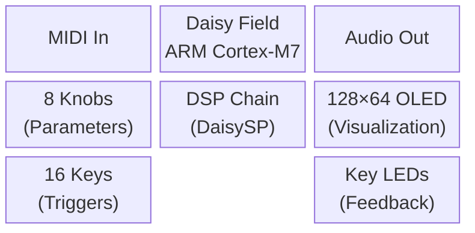
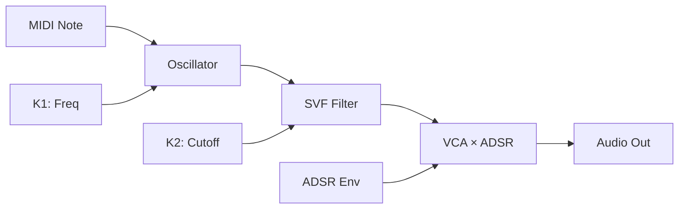
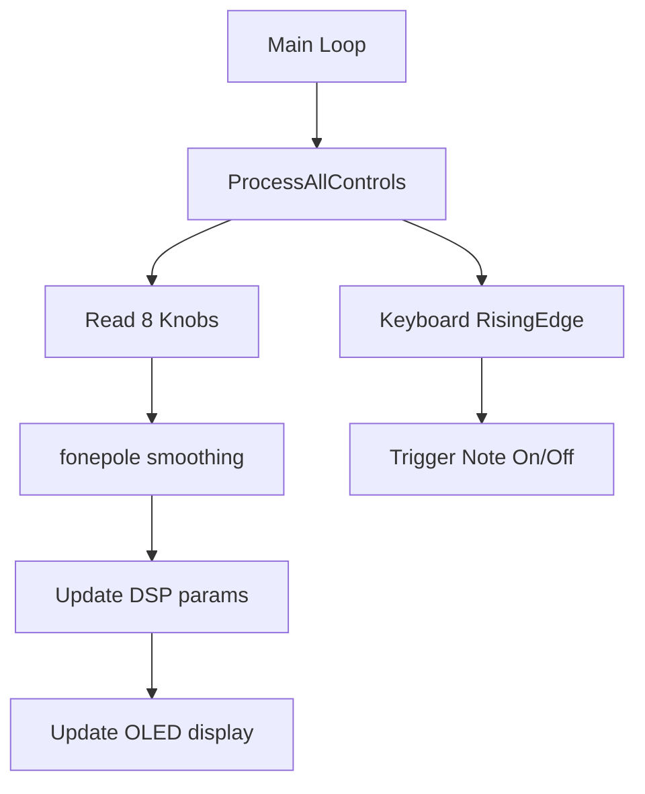

# DAISY_QAE Workflow Enforcer

## Overview

Every Daisy project MUST follow the 5-step QAE workflow. This skill enforces it.
The workflow prevents hallucinated APIs, under-specified controls, and first-compile failures
by requiring design artifacts before any code is written.

## The Iron Law

> **NO C++ CODE** before CONCEPT + BLOCK DIAGRAMS + CONTROLS.md are complete
> and user-approved.

No exceptions. "Simple patch", "quick test", "just a prototype", "just one file" — none of
these override the Iron Law. If the user pushes back, explain why (bad APIs, missing controls,
scope creep) and redirect to the current gate.

---

## When to Use

Trigger this skill whenever the user:

- Asks to create a new Daisy project (any platform)
- Asks to write C++ firmware for Daisy Seed/Pod/Field
- Asks to "build a synth / effect / drum machine"
- Asks to generate audio DSP code
- Opens a new session with Mode: C++

Do **not** trigger for:
- Fixing bugs in existing code (use `systematic-debugging` pattern instead)
- Modifying one file in an existing, already-designed project
- DVPE block definition work (use `/dvpe-development` instead)

---

## Core Pattern: 5 Gated Steps

Each step has a **Gate** — stop and wait for explicit user approval before advancing.
Present the gate output, then ask: *"Approve to advance to Step N?"*

---

### STEP 1 — CONCEPT

**Goal**: Define what we're building before selecting any modules.

**Produce**:

1. Purpose statement (1–2 sentences)
2. Target platform: `Field` / `Pod` / `Seed`
3. Required DaisySP modules (consult `dsp/core.txt` and `dsp/advanced.txt` first)
4. Required DAFX_2_Daisy modules if any (check `DAISY_DEVELOPMENT_STANDARDS.md`)
5. Complexity rating 1–10
6. LGPL modules needed? (`ReverbSc`, `StringVoice`, `ModalVoice`, `MoogLadder`)

**MIDI Projects**: For external MIDI-oriented projects on Daisy Field, use [`field/Midi/Midi.cpp`](https://github.com/electro-smith/DaisyExamples/tree/master/field/Midi/Midi.cpp) as the base reference. This provides:
- MIDI input handling (NoteOn, NoteOff, ControlChange)
- Voice management with ADSR envelope
- Filter control via MIDI CC
- Display feedback for MIDI notes

**References**:

- `DaisyExamples/MyProjects/foundation_examples/dsp/core.txt` — 33 core DSP modules
- `DaisyExamples/MyProjects/foundation_examples/dsp/advanced.txt` — 29 advanced modules
- `DaisyExamples/DAISY_QAE/DAISY_DEVELOPMENT_STANDARDS.md` — available module catalog

**Gate 1**: Present CONCEPT. Wait for approval. Do not proceed to Step 2 until approved.

---

### STEP 2 — BLOCK DIAGRAMS

**Goal**: Visualize the system before writing any code.

**Produce all 3 diagrams** (all are required, no exceptions):

**A. System Architecture** (`block-beta` Mermaid) — hardware blocks and data domains:



**B. Signal Flow** (`flowchart LR`) — audio signal path:



**C. Control Flow** (`flowchart TD`) — parameter update logic:



**References**:

- `DaisyExamples/MyProjects/foundation_examples/platforms/field1.txt` — Field platform patterns
- `DaisyExamples/MyProjects/foundation_examples/platforms/field2_synth.txt` — Field synth examples
- `DaisyExamples/MyProjects/foundation_examples/platforms/field3_effects.txt` — Field effects
- `DaisyExamples/MyProjects/foundation_examples/platforms/pod.txt` — Pod platform patterns
- `DaisyExamples/DAISY_QAE/DAISY_DEVELOPMENT_STANDARDS.md` — diagram patterns

**Gate 2**: Present all 3 diagrams. Wait for approval. Do not proceed to Step 3 until all 3 approved.

---

### STEP 3 — CONTROLS.md

**Goal**: Define every physical control before writing the audio callback.

**Produce `CONTROLS.md`** containing:

1. **Control Mapping Table** — all active knobs, keys, switches, CV ins
2. **OLED Display Layout** — what is shown by default vs. on parameter change
3. **LED Behavior** — key LEDs: toggle / momentary / mode indicators
4. **At least 1 preset** with named parameter values

**Template**:

```markdown
# CONTROLS — [Project Name]

## Knob Mapping
| Knob | Parameter | Range | Unit |
|------|-----------|-------|------|
| K1   | Frequency | 20–2000 | Hz |
| K2   | Resonance | 0–1    | — |
...

## Key Mapping (Field)
| Key  | Function         | LED Behavior |
|------|------------------|--------------|
| A1   | Trigger note C4  | On while held |
...

## Switches
| Switch | Function |
|--------|----------|
| SW1    | Waveform: Saw/Square |

## OLED Display
- Idle: Title + last-changed parameter
- Param zoom: 1.2s after any knob move

## Presets
### Init (default)
| Param | Value |
|-------|-------|
| Freq  | 440 Hz |
```

**References**:

- `DaisyExamples/DAISY_QAE/DAISY_DEVELOPMENT_STANDARDS.md` — CONTROLS.md template

**Gate 3**: Present CONTROLS.md. Wait for approval. Do not proceed to Step 4 until approved.

---

### STEP 4 — IMPLEMENTATION

**Goal**: Write production-ready C++ using verified APIs and approved design artifacts.

**Mandatory reads before writing a single line of code**:

1. `DaisyExamples/DAISY_QAE/DAISY_DEVELOPMENT_STANDARDS.md` — code template for target platform
2. `DaisyExamples/DAISY_QAE/DAISY_TUTORIALS_KNOWLEDGE.md` — verified API signatures
3. `DaisyExamples/DAISY_QAE/DAISY_HALLUCINATION_REFERENCE.md` — common wrong APIs to avoid
4. `.agent/skills/daisy_cpp/SKILL.md` — FieldUX requirement, project structure
5. Relevant platform example file (field1/field2/field3/pod) from `foundation_examples/platforms/`

**Field-specific mandatory rules**:

- Include `field_defaults.h` — eliminates LED indexing bugs, provides `FieldKeyboardLEDs` + `FieldOLEDDisplay`
- Use `FieldOLEDDisplay` for parameter visualization (zoom popup on knob change)
- Audio callback: `out[0][i]` / `out[1][i]` — **non-interleaved** (NOT `out[i]`, NOT `out[i*2]`)
- `hw.StartAdc()` MUST be called before `hw.StartAudio()`
- All DSP `.Init(sample_rate)` MUST be called before `hw.StartAudio()`
- Control reads (`ProcessAllControls`, knob reads) ONLY in main loop — never in audio callback
- Use `fonepole()` for all knob-controlled DSP parameters (prevents zipper noise)
- Project goes in `DaisyExamples/MyProjects/_projects/<project_name>/`

**Pod-specific mandatory rules**:

- Interleaved buffer: `out[i*2]` (L), `out[i*2+1]` (R)
- `hw.ProcessAllControls()` may be in callback (lightweight)

**Code quality gate** (before declaring Step 4 done):

```bash
python DaisyExamples/DAISY_QAE/validate_daisy_code.py <project>.cpp
```

All 9 rules must pass. Fix any failures before proceeding to Step 5.

---

### STEP 5 — VERIFY

**Goal**: Confirm the code works on hardware.

**Checklist**:

- [ ] `make clean && make` exits with code 0 (zero errors, warnings reviewed)
- [ ] `make program` (ST-Link) flashes successfully
- [ ] All knobs tested — no zipper noise, correct ranges
- [ ] All keys/switches tested — correct trigger behavior
- [ ] OLED displays correct information
- [ ] MIDI input responds (if applicable)
- [ ] Update CONTROLS.md with any changes found during testing
- [ ] Log any bugs to `DaisyExamples/DAISY_QAE/DAISY_BUGS.md`

---

## Quick Reference

| Step | Artifact | Gate |
|------|----------|------|
| 1 CONCEPT | Purpose + modules + platform | User approves |
| 2 BLOCK DIAGRAMS | 3 Mermaid diagrams | User approves all 3 |
| 3 CONTROLS.md | Full control/OLED mapping | User approves |
| 4 IMPLEMENTATION | C++ + Makefile + linter pass | Code complete |
| 5 VERIFY | Build + flash + hardware test | All checklist items ✓ |

---

## Red Flags — Common Violations

These requests violate the Iron Law. Redirect to the correct gate instead of complying.

| Request | Correct Response |
|---------|-----------------|
| "Just give me the C++ quickly" | "We're at Step N. Let's finish that gate first." |
| "Skip the diagrams for a simple patch" | "All 3 diagrams are required. They take 5 min and prevent 2-hour debug sessions." |
| "I'll do CONTROLS.md later" | "Controls must be defined before the audio callback — otherwise we guess at the API." |
| "Just a prototype, skip Step 2" | "Prototypes become permanent. The Iron Law applies." |
| "Can you just show me the filter code?" | "Yes — after CONCEPT and BLOCK DIAGRAMS are approved." |

---

## Reference Files

### DAISY_QAE Knowledge Base

- `DaisyExamples/DAISY_QAE/DAISY_DEVELOPMENT_STANDARDS.md` — workflow, templates, pitfalls
- `DaisyExamples/DAISY_QAE/DAISY_TUTORIALS_KNOWLEDGE.md` — official API signatures
- `DaisyExamples/DAISY_QAE/DAISY_HALLUCINATION_REFERENCE.md` — wrong API → correct API table
- `DaisyExamples/DAISY_QAE/DAISY_DEBUG_STRATEGY.md` — debugging methodology
- `DaisyExamples/DAISY_QAE/DAISY_BUGS.md` — project bug log
- `DaisyExamples/DAISY_QAE/validate_daisy_code.py` — 9-rule linter

### Foundation Examples (DSP + Platform)

- `DaisyExamples/MyProjects/foundation_examples/field_defaults.h` — FieldKeyboardLEDs, FieldOLEDDisplay
- `DaisyExamples/MyProjects/foundation_examples/FIELD_DEFAULTS_USAGE.md` — usage guide
- `DaisyExamples/MyProjects/foundation_examples/platforms/field1.txt` — Field hardware + MIDI
- `DaisyExamples/MyProjects/foundation_examples/platforms/field2_synth.txt` — Field synthesizers
- `DaisyExamples/MyProjects/foundation_examples/platforms/field3_effects.txt` — Field effects
- `DaisyExamples/MyProjects/foundation_examples/platforms/pod.txt` — Pod patterns
- `DaisyExamples/MyProjects/foundation_examples/dsp/core.txt` — 33 core DSP modules
- `DaisyExamples/MyProjects/foundation_examples/dsp/advanced.txt` — 29 advanced modules

### Coding Standards

- `.agent/skills/daisy_cpp/SKILL.md` — FieldUX, project structure, hardware assumptions
