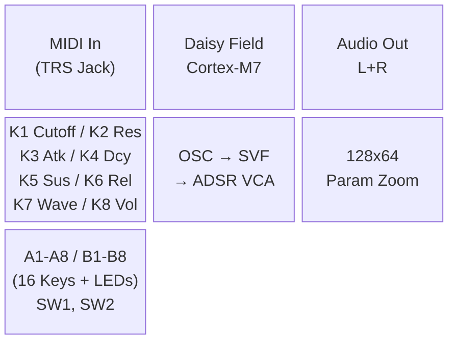
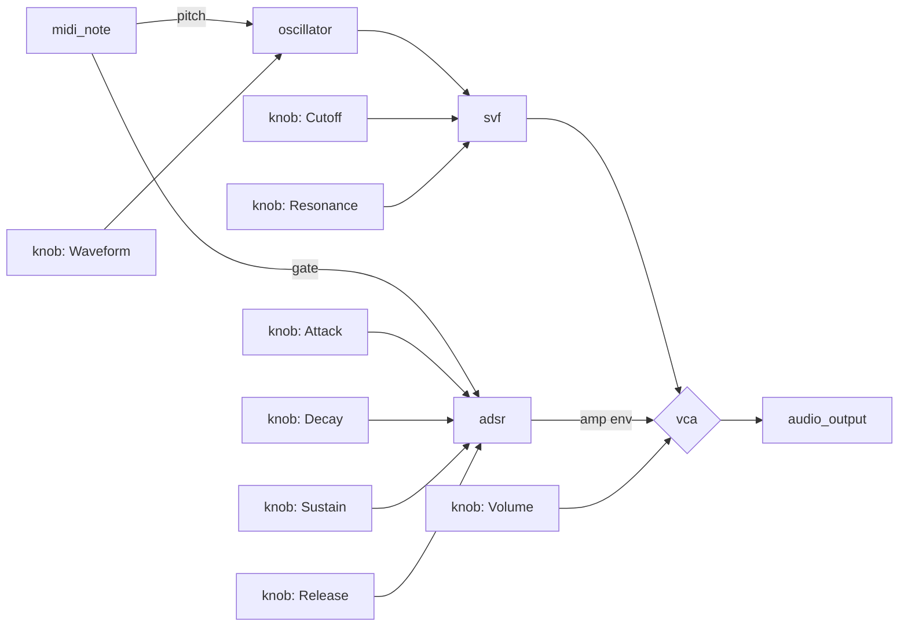
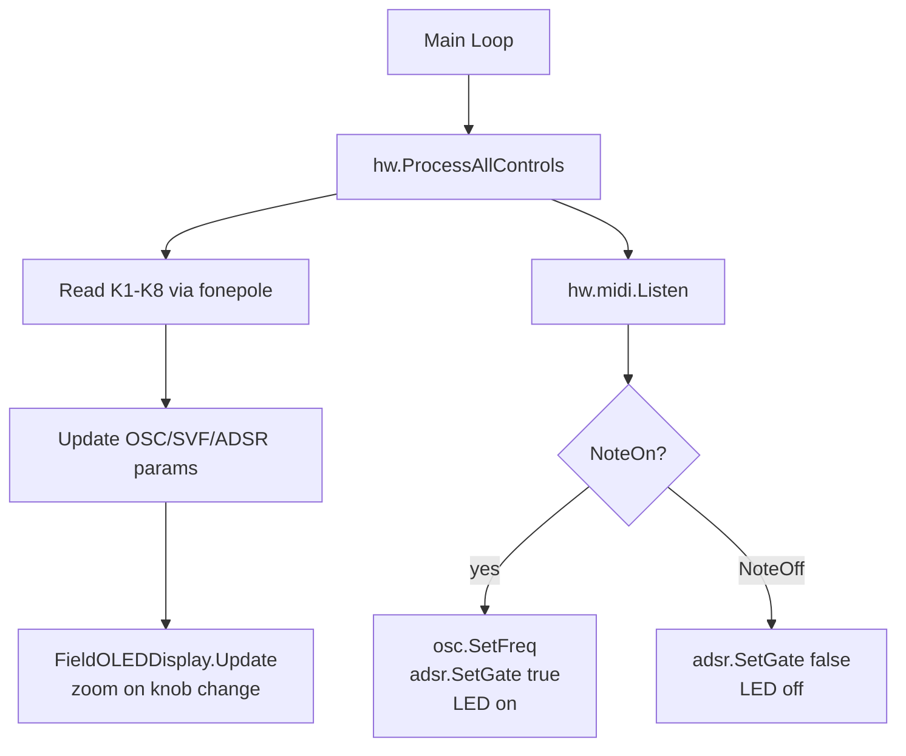
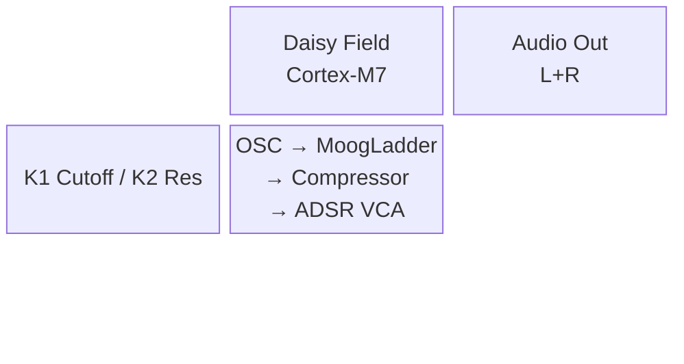
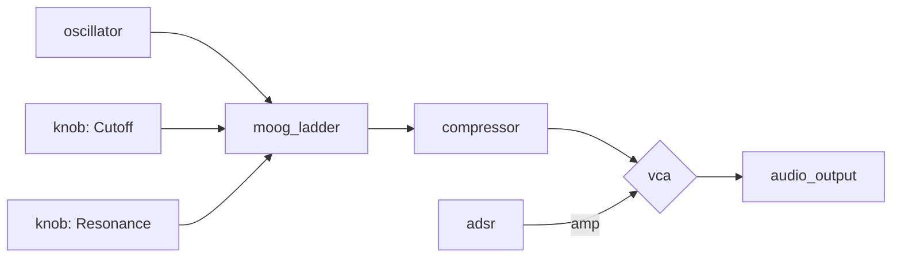
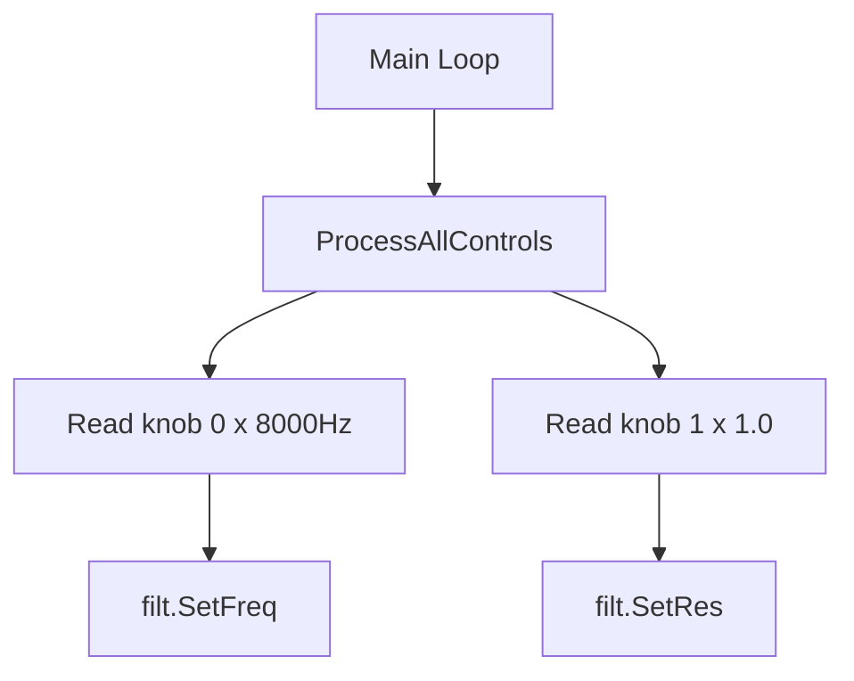
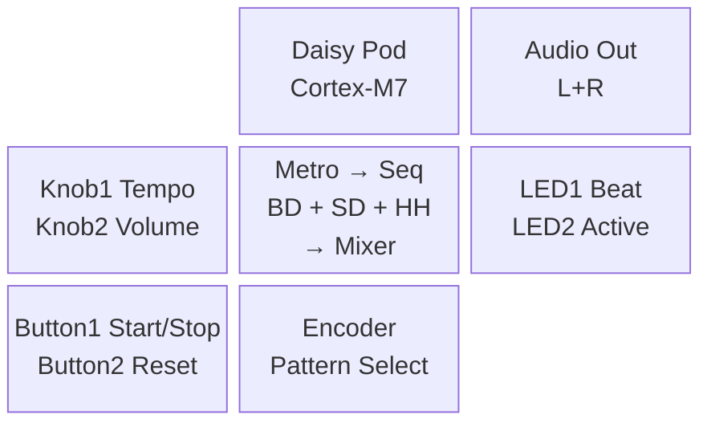
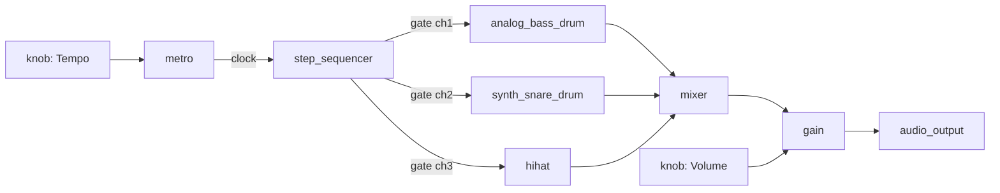
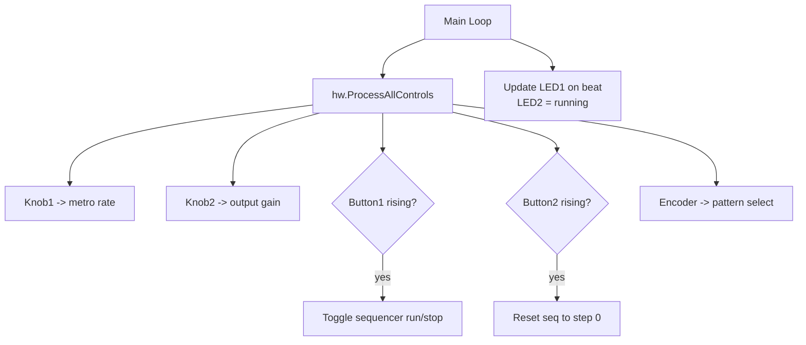

# DVPE Development Examples

Three complete workflow traces covering the main usage patterns.

---

## Example 1: Natural Language → 3 Diagrams → .dvpe (Mono Synth, Daisy Field)

**User**: "Create a monophonic subtractive synth with SVF filter, ADSR, and MIDI input for Daisy Field."

---

### MODE 1 — DESIGN (agent produces all 3, waits for approval)

**A. Block Diagram** (system architecture)



**B. Audio Flow** (signal path — maps directly to .dvpe blocks)



**C. Control Visualization** (parameter update logic in main loop)



*→ Gate 1: "Approve all 3 diagrams to advance to .dvpe generation?"*

---

### MODE 2 — MAP (Mermaid → .dvpe)

**Gap analysis**: All Audio Flow nodes map to known `definitionId` strings.

| Mermaid Node | definitionId | LGPL? |
|-------------|-------------|-------|
| `midi_note` | `midi_note` | No |
| `oscillator` | `oscillator` | No |
| `svf` | `svf` | No |
| `adsr` | `adsr` | No |
| `vca` | `vca` | No |
| `audio_output` | `audio_output` | No |
| `knob` x8 | `knob` | No |

**Generated .dvpe** (abbreviated):

```json
{
  "version": "1.0.0",
  "patch": {
    "metadata": {
      "name": "FieldMonoSynth",
      "author": "DVPE",
      "description": "Mono subtractive synth with SVF filter and ADSR",
      "created": "2026-02-26T00:00:00Z",
      "modified": "2026-02-26T00:00:00Z",
      "version": "1.0.0",
      "targetHardware": "field",
      "sampleRate": 48000,
      "blockSize": 4
    },
    "blocks": [
      { "id": "midi-1",  "definitionId": "midi_note",   "position": {"x": 100, "y": 300}, "parameterValues": {}, "label": "MIDI" },
      { "id": "osc-1",   "definitionId": "oscillator",  "position": {"x": 300, "y": 300}, "parameterValues": {"freq": 440, "waveform": "WAVE_SAW"}, "label": "OSC" },
      { "id": "filt-1",  "definitionId": "svf",         "position": {"x": 500, "y": 300}, "parameterValues": {"freq": 2000, "res": 0.2}, "label": "SVF" },
      { "id": "env-1",   "definitionId": "adsr",        "position": {"x": 300, "y": 500}, "parameterValues": {"attack": 0.01, "decay": 0.2, "sustain": 0.7, "release": 0.4}, "label": "ENV" },
      { "id": "vca-1",   "definitionId": "vca",         "position": {"x": 700, "y": 300}, "parameterValues": {}, "label": "VCA" },
      { "id": "out-1",   "definitionId": "audio_output","position": {"x": 900, "y": 300}, "parameterValues": {}, "label": "OUTPUT" },
      { "id": "k1",      "definitionId": "knob",        "position": {"x": 100, "y": 100}, "parameterValues": {"index": 0}, "label": "K1 Cutoff" },
      { "id": "k2",      "definitionId": "knob",        "position": {"x": 300, "y": 100}, "parameterValues": {"index": 1}, "label": "K2 Resonance" }
    ],
    "connections": [
      { "id": "c1",  "sourceBlockId": "midi-1",  "sourcePortId": "pitch", "targetBlockId": "osc-1",  "targetPortId": "freq",    "type": "cv" },
      { "id": "c2",  "sourceBlockId": "midi-1",  "sourcePortId": "gate",  "targetBlockId": "env-1",  "targetPortId": "gate",    "type": "trigger" },
      { "id": "c3",  "sourceBlockId": "osc-1",   "sourcePortId": "out",   "targetBlockId": "filt-1", "targetPortId": "in",      "type": "audio" },
      { "id": "c4",  "sourceBlockId": "filt-1",  "sourcePortId": "low",   "targetBlockId": "vca-1",  "targetPortId": "in",      "type": "audio" },
      { "id": "c5",  "sourceBlockId": "env-1",   "sourcePortId": "out",   "targetBlockId": "vca-1",  "targetPortId": "cv",      "type": "cv" },
      { "id": "c6",  "sourceBlockId": "vca-1",   "sourcePortId": "out",   "targetBlockId": "out-1",  "targetPortId": "left",    "type": "audio" },
      { "id": "c7",  "sourceBlockId": "k1",      "sourcePortId": "out",   "targetBlockId": "filt-1", "targetPortId": "freq",    "type": "cv" },
      { "id": "c8",  "sourceBlockId": "k2",      "sourcePortId": "out",   "targetBlockId": "filt-1", "targetPortId": "res",     "type": "cv" }
    ]
  }
}
```

**Saved to**: `_block_diagrams_code/field_mono_synth.dvpe`

---

### MODE 3 — CODEGEN (raw C++ skeleton)

**Platform**: Field (non-interleaved audio)

```cpp
#include "daisy_field.h"
#include "daisysp.h"

using namespace daisy;
using namespace daisysp;

DaisyField hw;
Oscillator osc;
Svf         filt;
Adsr        env;
// vca implemented inline (multiply signal * envelope)

static bool noteOn = false;

void HandleMidi(MidiEvent m) {
    if(m.type == NoteOn && m.AsNoteOn().velocity > 0) {
        osc.SetFreq(mtof(m.AsNoteOn().note));
        env.SetGate(true);
        noteOn = true;
    } else if(m.type == NoteOff || (m.type == NoteOn && m.AsNoteOn().velocity == 0)) {
        env.SetGate(false);
        noteOn = false;
    }
}

void AudioCallback(AudioHandle::InputBuffer in,
                   AudioHandle::OutputBuffer out, size_t size) {
    for(size_t i = 0; i < size; i++) {
        float sig = osc.Process();
        filt.Process(sig);
        sig = filt.Low();
        sig *= env.Process(noteOn);
        out[0][i] = out[1][i] = sig;
    }
}

int main(void) {
    hw.Init();
    hw.SetAudioBlockSize(4);
    float sr = hw.AudioSampleRate();

    osc.Init(sr);
    filt.Init(sr);
    env.Init(sr);
    osc.SetWaveform(Oscillator::WAVE_SAW);

    hw.midi.StartReceive();
    hw.StartAdc();
    hw.StartAudio(AudioCallback);

    while(true) {
        hw.ProcessAllControls();
        hw.midi.Listen();
        while(hw.midi.HasEvents()) HandleMidi(hw.midi.PopEvent());
        // K1-K8 reads + fonepole smoothing go here
    }
}
```

> **This is a raw C++ skeleton.** Run `/daisy-qae` Step 4 on this file. The linter will
> check for missing `fonepole()` smoothing, correct API names, and Field-specific requirements.
> Complete Steps 4–5 for hardware-verified firmware.

---

---

## Example 2: C++ → 3 Diagrams → .dvpe (Reverse Engineer)

**User**: "I have this C++ patch. Convert it to a visual block diagram I can edit in DVPE."

**Input C++** (excerpt):

```cpp
Oscillator osc;
MoogLadder filt;
Compressor comp;
Adsr        env;

// AudioCallback:
float sig  = osc.Process();
filt.SetFreq(cutoff);
filt.SetRes(resonance);
sig = filt.Process(sig);
sig = comp.Process(sig);
sig *= env.Process(gate);
out[0][i] = out[1][i] = sig;

// main loop:
cutoff    = hw.knob[0].Process() * 8000.f;
resonance = hw.knob[1].Process();
```

---

### MODE 1 — DESIGN (reconstructed from C++ analysis)

**Analysis**:
- Class declarations: `Oscillator` → `oscillator`, `MoogLadder` → `moog_ladder`* (LGPL), `Compressor` → `compressor`, `Adsr` → `adsr`
- Signal chain: osc → filt → comp → VCA (env) → output
- Controls: `hw.knob[0]` → K1 (cutoff), `hw.knob[1]` → K2 (resonance)
- Platform: Daisy Field (non-interleaved `out[0][i]`)

**A. Block Diagram**



**B. Audio Flow**



**C. Control Visualization**



*→ Gate 1: "Approve all 3 diagrams to advance to .dvpe generation?"*

---

### MODE 2 — MAP (gap analysis)

| C++ Class | definitionId | LGPL? | Status |
|-----------|-------------|-------|--------|
| `Oscillator` | `oscillator` | No | Found |
| `MoogLadder` | `moog_ladder` | Yes | Found — flag LGPL |
| `Compressor` | `compressor` | No | Found |
| `Adsr` | `adsr` | No | Found |
| `knob[0]` | `knob` (index 0) | No | Found |
| `knob[1]` | `knob` (index 1) | No | Found |

**Makefile note**: `moog_ladder` requires `USE_DAISYSP_LGPL = 1`

**Generated .dvpe**: `_block_diagrams_code/reconstructed_moog_synth.dvpe`

---

---

## Example 3: Full Pipeline — Drum Machine → daisy-qae Handoff (Daisy Pod)

**User**: "Build a drum machine for Daisy Pod — bass drum, snare, hihat — with a step sequencer. Get it ready for hardware."

---

### MODE D — FULL PIPELINE

#### Step 1: MODE 1 — DESIGN

**A. Block Diagram**



**B. Audio Flow**



**C. Control Visualization**



*→ Gate 1: "Approve all 3 diagrams to advance to .dvpe generation?"*

**Gate 1 → approved**

---

#### Step 2: MODE 2 — MAP

**Gap analysis**: All nodes map to known `definitionId` strings.

| Mermaid Node | definitionId | LGPL? |
|-------------|-------------|-------|
| `metro` | `metro` | No |
| `step_sequencer` | `step_sequencer` | No |
| `analog_bass_drum` | `analog_bass_drum` | No |
| `synth_snare_drum` | `synth_snare_drum` | No |
| `hihat` | `hihat` | No |
| `mixer` | `mixer` | No |
| `gain` | `gain` | No |
| `audio_output` | `audio_output` | No |
| `knob` x2 | `knob` | No |

No LGPL modules — standard Makefile.

**Saved to**: `_block_diagrams_code/pod_drum_machine.dvpe`

---

#### Step 3: MODE 3 — CODEGEN

**Platform**: Pod (interleaved audio)

Raw C++ skeleton generated with:

- `Metro`, `StepSequencer`, `AnalogBassDrum`, `SynthSnareDrum`, `HiHat` declarations
- Interleaved `AudioCallback` (`out[i]`, `out[i+1]`)
- Main loop: `hw.ProcessAllControls()`, knob reads, button rising-edge detection, encoder read
- LED update in main loop

---

#### Step 4: daisy-qae Handoff

> **Raw C++ skeleton ready.**
>
> Next step: run `/daisy-qae` and go directly to **Step 4 (Implementation)**.
>
> Use `pod_drum_machine.cpp` as the base. The linter (`validate_daisy_code.py`) will verify:
> - All DSP `.Init(sr)` before `StartAudio()`
> - `fonepole()` smoothing on tempo knob
> - No malloc in AudioCallback
> - Pod interleaved audio pattern
>
> After linter passes: flash via `make program` (ST-Link), test all controls per Step 5.

---

---

## Anti-Pattern Reference

| User says | Wrong response | Correct response |
|-----------|---------------|-----------------|
| "Just give me the .dvpe now" | Writes JSON | Produces all 3 Mermaid diagrams, asks for approval |
| "Skip the block diagram" | Skips to audio flow only | "All 3 required — block diagram validates platform constraints." |
| "Write the C++ for me" | Writes production C++ | "MODE 3 gives a raw skeleton. For production firmware, use /daisy-qae." |
| "I need a Field encoder block" | Uses `encoder` block | "Field has NO encoder. Did you mean Pod? Or SW1/SW2 for Field?" |
| "Add CV input to Field synth" | Adds without asking | "CV/Gate on Field are available. Using them adds modular I/O — confirm?" |
| "Use reverb_sc" | Uses it silently | "reverb_sc is LGPL. Adding USE_DAISYSP_LGPL = 1 to Makefile — confirm?" |
