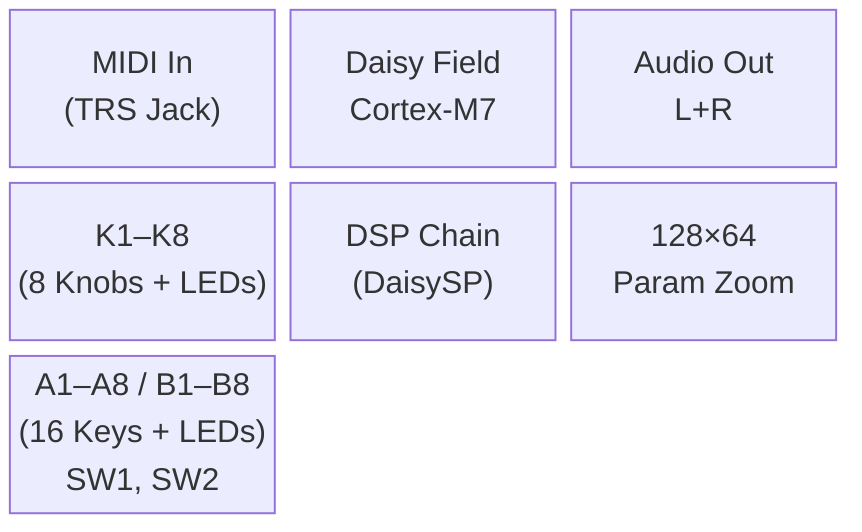
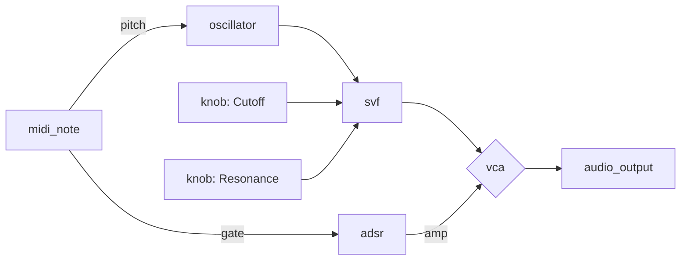
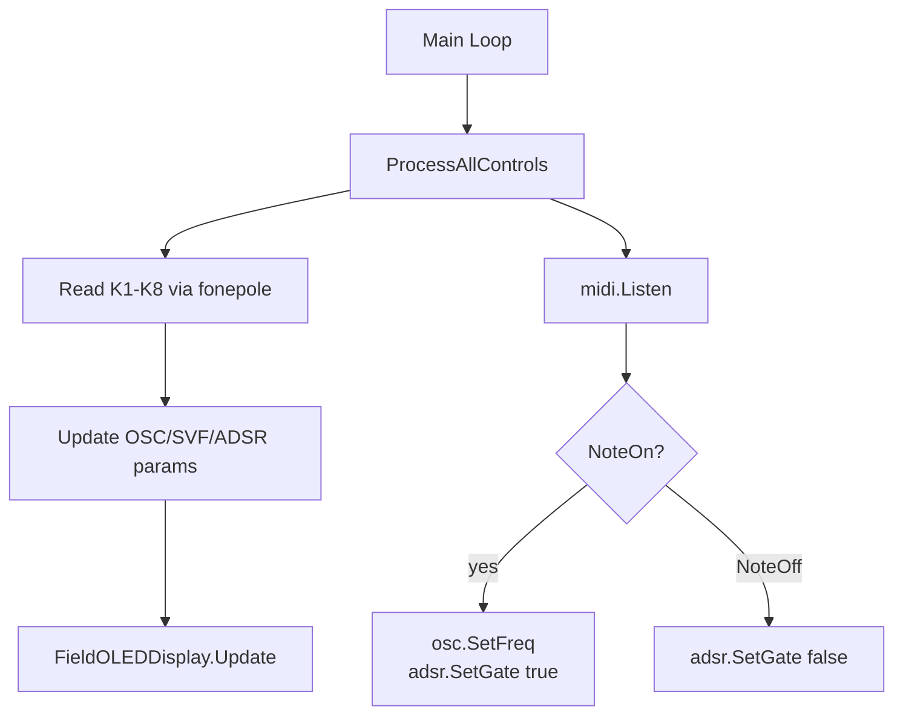

# DVPE Development Skill

## Overview

End-to-end visual programming workflow for Daisy audio patches:

- **Forward**: Natural Language / C++ → 3 Mermaid Diagrams → .dvpe → raw C++ → `/daisy-qae`
- **Reverse**: C++ Code → 3 Mermaid Diagrams → .dvpe (visual reconstruction)

---

## The Mermaid-First Rule

> **NO .dvpe JSON written before all 3 Mermaid diagrams are user-approved.**

The diagrams are the spec. Every node in the Audio Flow diagram maps 1:1 to a block
`definitionId` in the .dvpe output. Gap analysis happens at diagram stage — not after JSON
is half-written.

No exceptions. "Quick patch", "just the JSON", "I know what blocks I need" — none of these
override the rule. The diagrams take 5 minutes and prevent wrong block connections.

---

## Runtime Validation Rule

The block catalog below is a human quick reference only. Before trusting a
`definitionId`, port ID, generated `.dvpe`, or fixture, validate against the
live repo CLI:

```powershell
py -3 execution\dvpe_cli.py blocks export
py -3 execution\dvpe_cli.py patch validate <file.dvpe>
py -3 execution\dvpe_cli.py skill check
```

The exported `.tmp/block_library.json` and `patch validate` output are the
current source of truth. If this document disagrees with the CLI, follow the
CLI and update the skill.

---

## When to Use

Trigger this skill when the user:

- Asks to design a Daisy audio patch visually
- Wants to describe a synth/effect in natural language and get a .dvpe file
- Has existing C++ and wants to reverse-engineer it into a visual block diagram
- Wants a raw C++ skeleton generated from an existing .dvpe file
- Uses words: DVPE, block diagram, .dvpe, patch, visual programming, mermaid, signal flow

**Do NOT trigger for**:

- Writing production-ready C++ firmware directly → use `/daisy-qae` instead
- Debugging existing C++ → use systematic-debugging pattern
- DVPE app/TypeScript development → this skill is for patch design, not DVPE source code

---

## Core Pattern: 4 Modes

```text
MODE 1  DESIGN       NL/C++ → 3 Mermaid diagrams (A + B + C)
   ↓ [Gate 1: user approves all 3 diagrams]
MODE 2  MAP          Approved Mermaid → .dvpe JSON (verified definitionId strings)
MODE 3  CODEGEN      .dvpe → raw C++ skeleton
   ↓ [Handoff: run /daisy-qae Step 4 for production quality]
MODE D  PIPELINE     Modes 1 → 2 → 3 in sequence (full generation)
```

---

## MODE 1 — DESIGN

**Goal**: Visualize the patch design before generating any .dvpe JSON.

### Input Parsing

Before drawing, identify:

1. **Target platform** — Field / Pod / Seed / Custom HW (consult Platform Reference)
2. **Signal chain** — sound sources, processing blocks, output
3. **Control scheme** — which knobs/keys/switches control which parameters
4. **MIDI usage** — `midi_note` (pitch+gate) or `midi_cc` (continuous control) or none

### Produce All 3 Diagrams

All 3 are mandatory, no exceptions:

**A. Block Diagram** (`block-beta` Mermaid) — system architecture and hardware domains:



**B. Audio Flow** (`flowchart LR`) — signal path that directly maps to .dvpe blocks:



**C. Control Visualization** (`flowchart TD`) — parameter update sequence in main loop:



**Gate 1**: Present all 3 diagrams. Ask: *"Approve all 3 diagrams to advance to .dvpe generation?"*
Do not proceed to MODE 2 until explicitly approved.

### Node Naming Convention (Audio Flow diagram)

Use `definitionId` as the node ID so it maps directly to the Block Catalog:

```text
OSC[oscillator]       → block definitionId = "oscillator"
FILT[svf]             → block definitionId = "svf"
K1[knob: Cutoff]      → block definitionId = "knob" (index 0)
OUT[audio_output]     → block definitionId = "audio_output"
```

---

## MODE 2 — MAP

**Goal**: Convert the approved Audio Flow diagram to a valid .dvpe JSON file.

### Step 1 — Block Lookup (Gap Analysis)

For every node in the Audio Flow diagram:

1. Run `py -3 execution\dvpe_cli.py blocks export` and find matching `definitionId`
2. If found → include in .dvpe blocks array
3. If NOT found → flag it:
   - Suggest nearest available block
   - Or mark as `custom_code` placeholder
   - Report to user before generating JSON

### Step 2 — Generate .dvpe JSON

Follow the schema exactly (see Schema Quick Reference below).

**Layout rule**: Place blocks left-to-right in signal flow order.

- x: start at 100, increment by 200 per stage
- y: center at 300 (controls above at y=100, effects at y=300, output at y=500)

**Platform metadata**:

| Platform | `targetHardware` value |
|----------|------------------------|
| Daisy Field | `"field"` |
| Daisy Pod | `"pod"` |
| Daisy Seed | `"seed"` |

**Save to**: `_block_diagrams_code/{patch_name}.dvpe`

### Step 3 — Schema Validation Checklist

Before declaring MODE 2 done, run:

```powershell
py -3 execution\dvpe_cli.py patch validate _block_diagrams_code\{patch_name}.dvpe
```

Also verify:

- [ ] Top-level `"version": "1.0.0"` present
- [ ] All blocks wrapped inside `"patch": { "blocks": [...] }` (not top-level)
- [ ] Every block uses `"definitionId"` (not `"type"`)
- [ ] Every block has `"parameterValues"` (not `"parameters"`)
- [ ] Every connection uses `"sourceBlockId"` / `"targetBlockId"` (not `"sourceId"`)
- [ ] Every connection uses `"sourcePortId"` / `"targetPortId"` (not `"sourcePort"`)
- [ ] All block IDs referenced in connections exist in the blocks array
- [ ] LGPL blocks (marked `*` in catalog) have `USE_DAISYSP_LGPL = 1` noted for Makefile

---

## MODE 3 — CODEGEN

**Goal**: Generate a raw C++ skeleton from the .dvpe file for handoff to `/daisy-qae`.

### Process

1. Load .dvpe, extract blocks and connections
2. Topological sort (from output block back to sources)
3. Generate:
   - `#include` directives
   - Global DSP object declarations
   - `AudioCallback()` — signal processing order from topo sort
   - `main()` — Init, StartAdc, StartAudio, main loop

### Platform Audio Pattern

**Field** (non-interleaved):

```cpp
void AudioCallback(AudioHandle::InputBuffer in,
                   AudioHandle::OutputBuffer out, size_t size) {
    for(size_t i = 0; i < size; i++) {
        out[0][i] = out[1][i] = signal;  // non-interleaved
    }
}
```

**Pod / Seed** (interleaved):

```cpp
void AudioCallback(AudioHandle::InterleavingInputBuffer in,
                   AudioHandle::InterleavingOutputBuffer out, size_t size) {
    hw.ProcessAllControls();
    for(size_t i = 0; i < size; i += 2) {
        out[i] = out[i+1] = signal;  // interleaved L/R
    }
}
```

### Output

- `ProjectName.cpp` — raw C++ skeleton
- `Makefile` — skeleton with correct library paths and LGPL flag if needed

### Handoff Note (MANDATORY)

Always append this after delivering the code:

> **This is a raw C++ skeleton.** It compiles structurally but is NOT production-ready.
> To get production-quality firmware: run `/daisy-qae` and go directly to **Step 4 (Implementation)**.
> Use this file as the base. The linter will catch hallucinated APIs, missing `StartAdc()`, and
> other issues. Complete Steps 4–5 for hardware-verified firmware.

---

## MODE D — FULL PIPELINE

**Goal**: Complete generation from description (or C++) to raw C++ in one session.

```text
Step 1: MODE 1 — produce 3 Mermaid diagrams
Step 2: Gate 1 — wait for user approval of all 3
Step 3: MODE 2 — generate .dvpe JSON
Step 4: MODE 3 — generate raw C++ skeleton
Step 5: Handoff to /daisy-qae
```

---

## Block Catalog

Human quick reference only. The live source of truth is:

```powershell
py -3 execution\dvpe_cli.py blocks export
```

`*` = LGPL module — requires `USE_DAISYSP_LGPL = 1` in Makefile

### Sources

| definitionId | Description |
|-------------|-------------|
| `oscillator` | Band-limited multi-waveform oscillator (saw, sin, tri, square) |
| `fm2` | 2-operator FM oscillator |
| `particle` | Particle noise / pitched oscillator |
| `grainlet_oscillator` | Grainlet oscillator |
| `white_noise` | White noise generator |
| `dust` | Sparse impulse noise |
| `dc_source` | Constant DC signal |
| `phasor` | Linear ramp 0→1 oscillator |
| `clocked_noise` | Sample-and-hold noise at clock rate |
| `formant_oscillator` | Formant synthesis oscillator |
| `vosim_oscillator` | VOSIM voice synthesis |
| `variable_shape_oscillator` | Waveshaping oscillator |
| `harmonic_oscillator` | Harmonic series oscillator |
| `oscillator_bank` | Bank of oscillators |
| `variable_saw_oscillator` | Variable-slope sawtooth |
| `z_oscillator` | Z-plane oscillator |
| `pluck` | Karplus-Strong string pluck |
| `string_voice` `*` | Physical modeling string voice (LGPL) |
| `modal_voice` `*` | Modal synthesis voice (LGPL) |
| `drip` | Water drip physical model |

### Filters

| definitionId | Description |
|-------------|-------------|
| `svf` | State variable filter (low/high/band/notch) |
| `moog_ladder` `*` | Moog ladder filter (LGPL) |
| `one_pole` | One-pole lowpass/highpass |
| `atone` | High-pass one-pole filter |
| `dc_block` | DC offset removal filter |
| `low_shelving` | Low shelving EQ |
| `high_shelving` | High shelving EQ |
| `peak_filter` | Parametric peak EQ |
| `tone_stack` | Guitar amp tone stack |
| `lp_iir_comb` | Lowpass IIR comb filter |

### Effects

| definitionId | Description |
|-------------|-------------|
| `chorus` | Multi-voice chorus |
| `flanger` | Flanger with LFO modulation |
| `phaser` | Phaser effect |
| `overdrive` | Soft overdrive distortion |
| `distortion` | Hard distortion |
| `bitcrush` | Bit crusher (bit depth reduction) |
| `decimator` | Sample rate decimator |
| `softclip` | Soft clipping waveshaper |
| `hardclip` | Hard clipping waveshaper |
| `wavefolder` | Wavefolder |
| `fold` | Simple fold distortion |
| `rectifier` | Half/full wave rectifier |
| `tremolo` | Amplitude tremolo |
| `vibrato` | Pitch vibrato |
| `autowah` | Auto-wah envelope follower |
| `wahwah` | Wah-wah pedal effect |
| `tube` | Tube amp saturation |
| `ring_modulator` | Ring modulator |
| `resonator` | Resonant string model |
| `pitch_shifter` | Pitch shifter |
| `sample_rate_reducer` | Sample rate reduction |
| `universal_comb` | Universal comb filter |
| `phase_vocoder_pitch` | Phase vocoder pitch shift |
| `sola_time_stretch` | SOLA time stretching |
| `robotization` | Robotization spectral effect |
| `whisperization` | Whisperization spectral effect |
| `looper` | Audio looper |

### Reverb / Delay

| definitionId | Description |
|-------------|-------------|
| `reverb_sc` `*` | ReverbSc algorithmic reverb (LGPL) |
| `fdn_reverb` | Feedback delay network reverb |
| `delay_line` | Delay line |

### Modulators

| definitionId | Description |
|-------------|-------------|
| `adsr` | Attack-Decay-Sustain-Release envelope |
| `ad_env` | Attack-Decay envelope |
| `lfo` | Low-frequency oscillator |
| `metro` | Metronome / clock pulse |
| `step_sequencer` | Step sequencer |
| `arpeggiator` | Arpeggiator |
| `sample_hold` | Sample and hold |
| `envelope_follower` | Envelope follower |
| `gate_length` | Gate duration control |
| `fsm_4` | 4-state finite state machine |

### Dynamics

| definitionId | Description |
|-------------|-------------|
| `compressor` | Dynamics compressor |
| `limiter` | Signal limiter |
| `noise_gate` | Noise gate |
| `compressor_expander` | Combined compressor/expander |
| `gate` | Signal gate (open/close) |

### Mixing / Routing

| definitionId | Description |
|-------------|-------------|
| `mixer` | N-input mono mixer |
| `stereo_mixer` | Stereo mixer |
| `crossfade` | Crossfade between two signals |
| `pan` | Mono-to-stereo panning |
| `stereo_pan` | Stereo panning |
| `balance` | L/R balance control |
| `vca` | Voltage-controlled amplifier |
| `linear_vca` | Linear VCA |
| `gain` | Fixed gain amplifier |
| `mux` | Signal multiplexer (select input) |
| `demux` | Signal demultiplexer (select output) |
| `splitter` | Split one signal to many |
| `merger` | Merge many signals to one |
| `bypass` | Passthrough / bypass switch |

### Hardware I/O

| definitionId | Platform | Description |
|-------------|----------|-------------|
| `audio_input` | All | Audio input (mic/line) |
| `audio_output` | All | Audio output (L+R) |
| `knob` | Field(×8), Pod(×2), Seed | ADC potentiometer |
| `key` | Field(A1-A8, B1-B8 = ×16), Pod(×2) | Keyboard key / button |
| `encoder` | Pod | Rotary encoder (Field has NONE) |
| `slider` | Custom | Linear slider |
| `switch` | Field(SW1/SW2), Custom | Toggle switch |
| `cv_input` | Field, Custom | CV input (use only if explicitly requested) |
| `cv_output` | Field, Custom | CV output (use only if explicitly requested) |
| `gate_trigger_in` | All | Gate/trigger input |
| `gate_output` | Field, Custom | Gate output (use only if explicitly requested) |
| `led_output` | Field | LED output control |
| `midi_note` | Field, Pod | MIDI note (pitch + gate) |
| `midi_cc` | Field, Pod | MIDI continuous controller |

### Math

| definitionId | Operation |
|-------------|-----------|
| `add` | A + B |
| `subtract` | A - B |
| `multiply` | A x B |
| `divide` | A / B |
| `abs` | absolute value |
| `negate` | -A |
| `min` | min(A, B) |
| `max` | max(A, B) |
| `clamp` | clamp(A, lo, hi) |
| `scale` | A x scale factor |
| `offset` | A + offset |
| `range_map` | Map A from [in_lo, in_hi] to [out_lo, out_hi] |
| `quantize` | Quantize to step grid |
| `modulo` | A mod B |
| `sign` | sign(A): -1, 0, +1 |
| `pow` | A ^ B |
| `pow2` | 2 ^ A |
| `sqrt` | square root of A |
| `reciprocal` | 1 / A |
| `log` | log(A) |
| `exp` | e ^ A |
| `sin` | sin(A) |
| `cos` | cos(A) |
| `tan` | tan(A) |
| `atan2` | atan2(Y, X) |
| `lerp` | linear interpolation A to B by t |

### Conversion

| definitionId | Description |
|-------------|-------------|
| `cv_to_freq` | CV (V/oct) to Hz |
| `db_to_linear` | dB to linear amplitude |
| `linear_to_db` | Linear amplitude to dB |
| `freq_to_midi` | Hz to MIDI note number |
| `midi_to_freq` | MIDI note to Hz |
| `cents_to_ratio` | Cents to frequency ratio |

### Logic / Control

| definitionId | Description |
|-------------|-------------|
| `equals` | A == B |
| `not_equals` | A != B |
| `greater` | A > B |
| `less` | A < B |
| `logic_and` | A AND B |
| `logic_or` | A OR B |
| `logic_not` | NOT A |
| `logic_xor` | A XOR B |
| `select` | Select A or B based on gate |
| `toggle` | Toggle state on trigger |
| `counter` | Count triggers |
| `sr_latch` | SR latch (Set/Reset) |
| `d_latch` | D latch |
| `edge_rise` | Rising edge detector |
| `edge_fall` | Falling edge detector |
| `schmitt_trigger` | Schmitt trigger with hysteresis |

### Signal Processing

| definitionId | Description |
|-------------|-------------|
| `slew` | Slew rate limiter (portamento) |
| `smooth` | Exponential smoothing |
| `sample_delay` | N-sample delay |
| `derivative` | Signal derivative (rate of change) |
| `integral` | Signal integrator |
| `ring_buffer` | Circular buffer |
| `zero_crossing` | Zero crossing detector |
| `wavetable_read` | Wavetable reader |
| `wavetable_write` | Wavetable writer |
| `mid_side_encode` | Stereo to M/S encoding |
| `mid_side_decode` | M/S to stereo decoding |
| `crosstalk_canceller` | Stereo crosstalk cancellation |
| `yin_pitch` | YIN pitch detection |

### Spectral

| definitionId | Description |
|-------------|-------------|
| `window_hann` | Hann window function |
| `window_hamming` | Hamming window function |
| `window_blackman` | Blackman window function |
| `overlap_add` | Overlap-add reconstruction |

### Drums

| definitionId | Description |
|-------------|-------------|
| `analog_bass_drum` | Analog bass drum model |
| `synth_bass_drum` | Synthetic bass drum |
| `analog_snare_drum` | Analog snare drum model |
| `synth_snare_drum` | Synthetic snare drum |
| `hihat` | Hi-hat model (open/closed) |

---

## Platform Reference

### Daisy Field

| Feature | Detail |
|---------|--------|
| Knobs | K1-K8 (index 0-7), each with Knob LED |
| Keyboard | A1-A8 (index 0-7) + B1-B8 (index 8-15), each with Key LED |
| Switches | SW1, SW2 |
| Display | 128x64 OLED |
| MIDI | MIDI IN + MIDI OUT (TRS hardware MIDI — default) |
| CV / Gate | CV IN/OUT, Gate IN/OUT — use only if explicitly requested |
| Encoder | NONE — Field does not have an encoder |
| Audio | Non-interleaved: `out[0][i]` (L), `out[1][i]` (R) |
| DVPE I/O | `knob`x8, `key`x16, `switch`x2, `midi_note`, `midi_cc`, `audio_output`, `audio_input` |

### Daisy Pod

| Feature | Detail |
|---------|--------|
| Knobs | Knob1 (index 0), Knob2 (index 1) |
| Buttons | Button1 (index 0), Button2 (index 1) |
| Encoder | 1x rotary encoder |
| LEDs | 2x RGB LED |
| Audio | Interleaved: `out[i]` (L), `out[i+1]` (R) |
| DVPE I/O | `knob`x2, `key`x2, `encoder`, `audio_input`, `audio_output` |

### Daisy Seed

| Feature | Detail |
|---------|--------|
| Controls | None built-in — generic ADC channels via `cv_input` |
| Audio | Configurable (non-interleaved by default) |
| DVPE I/O | `cv_input`, `gate_trigger_in`, `audio_input`, `audio_output` |

### Custom HW Platform

Use any combination of `cv_input`, `gate_trigger_in`, `knob`, `audio_input`, `audio_output`.
Set `targetHardware` to `"seed"` in .dvpe metadata. Document custom pin mapping alongside .dvpe.

---

## Red Flags

These requests violate the Mermaid-first rule. Redirect to the correct stage.

| Request | Correct Response |
|---------|-----------------|
| "Just generate the .dvpe now" | "Mermaid-first rule. All 3 diagrams required first — 5 min." |
| "Write the C++ directly, skip diagrams" | "For DVPE: diagrams -> .dvpe -> C++. For production C++: use /daisy-qae." |
| "Skip the block diagram, just the signal flow" | "All 3 required. Block diagram validates hardware context for platform." |
| "I know what blocks I need, skip MODE 1" | "List the blocks and I'll validate against the catalog, then draw fast." |
| "Add MyCustomEffect block" | "No matching definitionId. Nearest: [X]. Use custom C++ node or file a block request." |
| "Can you skip Gate 1?" | "Gate 1 is non-negotiable. Unapproved diagrams produce wrong connections." |

---

## Schema Quick Reference

### Correct .dvpe Structure

```json
{
  "version": "1.0.0",
  "patch": {
    "metadata": {
      "name": "Patch Name",
      "author": "Author",
      "description": "Description",
      "created": "2026-01-01T00:00:00Z",
      "modified": "2026-01-01T00:00:00Z",
      "version": "1.0.0",
      "targetHardware": "field",
      "sampleRate": 48000,
      "blockSize": 4
    },
    "blocks": [
      {
        "id": "block-osc-1",
        "definitionId": "oscillator",
        "position": { "x": 300, "y": 300 },
        "parameterValues": { "freq": 440, "waveform": "WAVE_SIN" },
        "label": "OSC"
      }
    ],
    "connections": [
      {
        "id": "conn-1",
        "sourceBlockId": "block-osc-1",
        "sourcePortId": "out",
        "targetBlockId": "block-out-1",
        "targetPortId": "left",
        "type": "audio"
      }
    ]
  }
}
```

### Common Mistakes

| Wrong | Correct |
|-------|---------|
| Top-level `"blocks": [...]` | Inside `"patch": { "blocks": [...] }` |
| `"type": "oscillator"` | `"definitionId": "oscillator"` |
| `"parameters": { "freq": 440 }` | `"parameterValues": { "freq": 440 }` |
| `"sourceId": "block-1"` | `"sourceBlockId": "block-1"` |
| `"sourcePort": "out"` | `"sourcePortId": "out"` |

### Connection Signal Types

| Type | Use for |
|------|---------|
| `"audio"` | Audio-rate signals (oscillator out, filter out) |
| `"cv"` | Control signals (knob out, envelope out, LFO out) |
| `"trigger"` | Gate/trigger pulses (metro out, sequencer gate) |

---

## Reference Files

### DVPE Block System

- `dvpe_CLD/src/core/blocks/BlockRegistry.ts` — authoritative block ID list
- `dvpe_CLD/src/core/blocks/definitions/` — individual block definition files
- `dvpe_CLD/src/codegen/CodeGenerator.ts` — C++ generation logic
- `execution/dvpe_cli.py` — live block export, `.dvpe` validation, fixture generation, and skill drift checks
- `.tmp/block_library.json` — generated block reference after `py -3 execution\dvpe_cli.py blocks export`

### Directives

- `directives/ai_patch_generation.md` — patch generation process
- `directives/dvpe_code_generation.md` — code generation process
- `directives/build_firmware.md` — compile and flash workflow

### Related Skills

- `/daisy-qae` — use after MODE 3 for production-quality C++ (Steps 4-5)
- `/document-analysis` — for indexing reference PDFs
