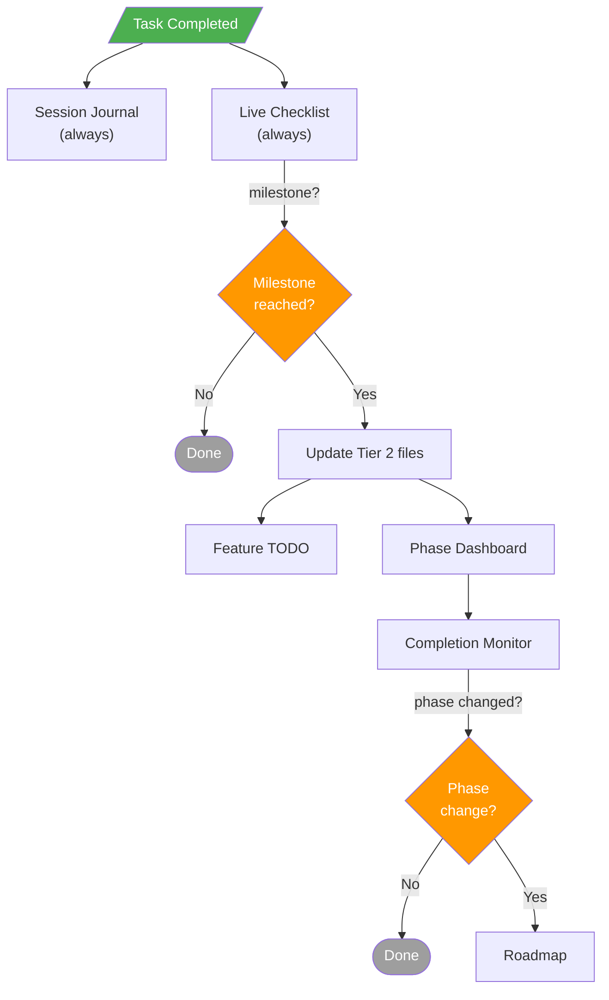

# Planning Document Management Skill

This skill prevents the **documentation drift problem**: when planning documents fall out of sync with code, causing agents to re-investigate already-completed work across multiple sessions.

## The Problem It Solves

In projects with multiple planning files (checklists, roadmaps, phase specs, handover docs), a completed task may be recorded in one file but left as "TODO" in others. This causes:
- Repeated discovery work (3+ sessions wasting time confirming the same tasks)
- Conflicting status claims across documents
- Loss of trust in planning documents

---

## Core Concepts

### 1. Tiered Update Hierarchy

Organize all planning documents into **4 tiers** by update frequency:

| Tier | Frequency | Trigger | Typical Documents |
|------|-----------|---------|-------------------|
| **1** | After each task | Task completion | Session journal, live task checklist |
| **2** | On milestone | Sub-phase or feature completion | Phase dashboard, feature TODO, deferred tracker |
| **3** | Session boundary | Session start/end | Roadmap, technical specs, handover docs |
| **4** | On process change | Scope/structure pivot | Governance rules, project charter, folder policy |

### 2. Cascade Rule

**Higher tiers cascade DOWN, never up.**

When you update a Tier 1 file and it reveals a milestone → update Tier 2.
When Tier 2 shows a phase-level change → update Tier 3.
Never update Tier 4 because of routine task completion.

```
Task done → Tier 1 (always)
                ↓ milestone?
            Tier 2 (phase dashboard, TODO)
                ↓ phase status changed?
            Tier 3 (roadmap)
```

### 3. Single Source of Truth

Designate ONE file as the **single source of truth for task-level status**. All other documents derive their status from this file. Typically this is a real-time checklist or kanban-style tracker (Tier 1).

---

## How to Set Up (New Project)

### Step 1: Inventory Your Planning Documents

List every planning-related file in your project. For each file, determine:
- What it tracks (tasks, phases, architecture, process?)
- How often it changes
- What other files depend on it

### Step 2: Assign Tiers

Map each document to one of the 4 tiers using this decision tree:

```
Does it change after every task?       → Tier 1
Does it change on feature milestones?  → Tier 2
Does it change per session?            → Tier 3
Does it only change on process pivots? → Tier 4
```

### Step 3: Define Cascade Edges

For each Tier 1 file, identify which Tier 2 files it feeds.
For each Tier 2 file, identify which Tier 3 files it feeds.
Document these edges in a `PLANNING_STATE_HIERARCHY.md` or equivalent.

### Step 4: Create the Hierarchy File

Create a file in your `PLANNING/` folder (or equivalent) with these sections:

1. **Update Tiers Table** — tier, frequency, trigger, files
2. **Interconnection Diagram** — Mermaid block-beta or flowchart showing relationships
3. **Cascade Flow** — flowchart showing the decision path after a task completes
4. **File-by-File Reference** — per-tier table with: file, what to update, what it cascades to
5. **Staleness Prevention Checklist** — end-of-session obligations

---

## How to Use (Every Session)

### On Task Completion

1. **Always update Tier 1 files** (session journal + live checklist)
2. Check: did this task complete a sub-phase milestone?
   - **Yes** → cascade to Tier 2 files (update percentages, mark features done)
   - **No** → stop
3. Check: did the Tier 2 update change a phase-level status?
   - **Yes** → cascade to Tier 3 files (update roadmap)
   - **No** → stop

### End of Session (Mandatory Checks)

Before ending any session, verify:

1. ☐ Session journal updated with work summary
2. ☐ Live task checklist has current checkboxes
3. ☐ If any sub-phase status changed → phase dashboard updated
4. ☐ If any phase status changed → roadmap updated
5. ☐ **All Tier 1 files agree** on percentages and task statuses

**Rule**: If in doubt, update the higher-tier file. Over-updating is better than staleness.

### Start of Session

Before starting work:

1. Read the live task checklist (Tier 1) — this is your source of truth
2. Verify the top 2 Tier 1 files agree on current status
3. If they disagree → **investigate and fix before proceeding** (this is drift)

---

## Anti-Patterns to Avoid

| Anti-Pattern | Why It's Bad | Fix |
|-------------|-------------|-----|
| Status duplicated in 5+ files | One gets missed → drift | Derive from single source of truth |
| Updating Tier 3 but not Tier 1 | Detail files stay stale | Always start from Tier 1 |
| "I'll update docs later" | You won't. Next session finds stale docs | Update immediately after task |
| Phase % in prose paragraphs | Hard to scan, easy to miss | Use tables with explicit numbers |
| Different agents update different files | No one owns the full cascade | Document cascade edges explicitly |

---

## Template: Cascade Flowchart (Mermaid)

Adapt this template for your project:



---

## Template: File-by-File Reference Table

```markdown
### Tier 1: Task-Level

| File | What to update | Cascades to |
|------|---------------|-------------|
| **session_journal.md** | Add task summary under current session | Nothing (terminal sink) |
| **progress_checklist.md** | Check/uncheck tasks, update status labels | If milestone reached → Tier 2 |

### Tier 2: Phase-Level

| File | What to update | Cascades to |
|------|---------------|-------------|
| **completion_monitor.md** | Phase % in dashboard table, audit history | If phase status changed → roadmap |
| **feature_todo.md** | Mark steps done with evidence | phase dashboard |

### Tier 3: Session-Level

| File | What to update | Cascades to |
|------|---------------|-------------|
| **roadmap.md** | Phase status list | Nothing (strategy doc) |
| **handover.md** | Update if onboarding context changes | Nothing (reference) |

### Tier 4: Static

| File | What to update | Cascades to |
|------|---------------|-------------|
| **governance.md** | Only on folder structure or process changes | Nothing |
```

---

## When This Skill Applies

Use this skill whenever:
- A project has **3+ planning documents** that track overlapping status
- You notice **conflicting status claims** across files
- A task or feature is reported as "TODO" in docs but exists in code
- You're starting a new project with phased planning
- You're onboarding to a project and need to understand which doc to trust

## When This Skill Does NOT Apply

- Single-file projects with one README
- Projects with automated issue trackers (GitHub Issues/Jira) as the single source of truth
- Pure documentation projects with no implementation status to track
