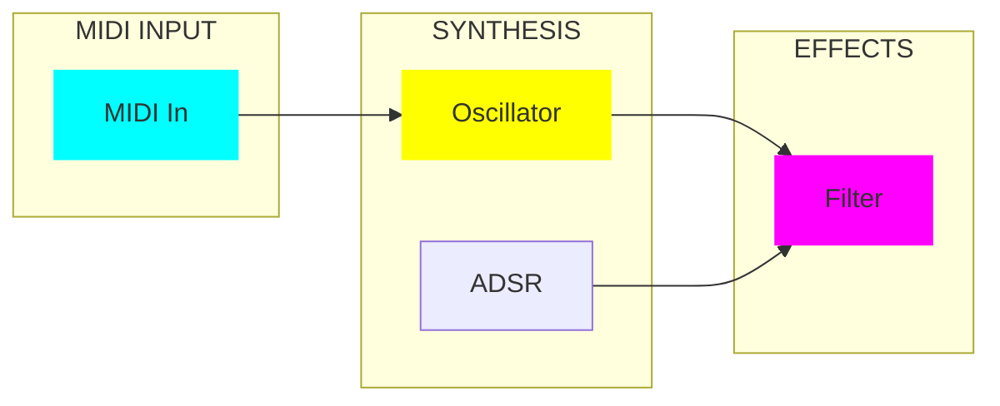

# Daisy Project Generator Skill

## Overview

Generates comprehensive synthesizer project specifications for Daisy hardware platforms. Creates documentation-ready output with pin mappings, signal flow diagrams, and OLED visualization code.

## Output Structure

For each project, generate:

1. **Project Description** (~100 words)
2. **Pin Mapping Table** (platform-specific)
3. **ASCII Block Diagram** (signal flow)
4. **Mermaid Block Diagram** (styled)
5. **OLED Display Implementation** (C++ code)

## Platform Templates

### Daisy Field Pin Mapping

| Control | Hardware | Signal |
|---------|----------|--------|
| K0-K7 | Knobs | Parameter control |
| SW1-SW2 | Switches | Mode select |
| Gate In | CV Jack | External trigger |
| CV1-CV4 | CV Jacks | Modulation sources |
| MIDI | DIN | External keyboard |
| Audio L/R | Jacks | Stereo output |

### Daisy Pod Pin Mapping

| Control | Hardware | Signal |
|---------|----------|--------|
| Knob1/Knob2 | Pots | Parameter control |
| Encoder | Rotary | Menu/value |
| Button1/Button2 | Buttons | Trigger/mode |
| LED1/LED2 | RGB | Visual feedback |
| Audio L/R | Jacks | Stereo output |

## Mermaid Diagram Style Guide

Use `GUI_4xLuminous_Language_DaisySP` conventions:



**Color Coding**:
- MIDI/Control: Cyan (`#0ff`)
- Sources/Synth: Yellow (`#ff0`)
- Effects: Magenta (`#f0f`)
- Output: Green (`#0f0`)
- Modulation: Orange (`#f80`)

## OLED Code Pattern

Use the `sequencer_pod` pattern from DAISY_EXPERT_SP_v5.2.md:

```cpp
// Change detection
float prevKnob[8], currKnob[8];
int zoomParam = -1;
uint32_t zoomStartTime = 0;

void CheckParameterChanges() {
    for(int i=0; i<8; i++) {
        if(fabsf(currKnob[i] - prevKnob[i]) > 0.02f) {
            zoomParam = i;
            zoomStartTime = System::GetNow();
            prevKnob[i] = currKnob[i];
        }
    }
    if(System::GetNow() - zoomStartTime > 1200) zoomParam = -1;
}

void DrawZoomedParameter() {
    char valBuf[32];
    float val = currKnob[zoomParam];
    int percent = (int)(val * 100.f);
    
    switch(zoomParam) {
        case 0: // Frequency
            sprintf(valBuf, "FREQ: %.0f Hz (%d%%)", 20.f + val * 2000.f, percent);
            break;
        case 1: // Time
            sprintf(valBuf, "TIME: %.0f ms (%d%%)", val * 1000.f, percent);
            break;
        default:
            sprintf(valBuf, "P%d: %.2f (%d%%)", zoomParam, val, percent);
    }
    
    hw.display.WriteString(valBuf, Font_11x18, true);
    hw.display.DrawRect(0, 50, (int)(val * 127.f), 58, true, true);
}
```

## Workflow

### Step 1: Gather Requirements
- Target platform (Field/Pod/Seed)
- Voice count
- Effect chain
- DAFX modules to use
- MIDI requirements

### Step 2: Generate Pin Mapping
- Map parameters to knobs
- Map controls to buttons/switches
- Define CV/Gate routing

### Step 3: Create Block Diagram
- ASCII version (text-based)
- Mermaid version (styled)

### Step 4: Generate OLED Code
- Parameter names array
- Value formatting per type
- Progress bar rendering

### Step 5: Compile Documentation
- Combine all sections
- Add to `docs/Daisy_Field_Synthesizer_Projects_*.md`

## DAFX Module Reference

| Module | Type | Parameters |
|--------|------|------------|
| Tube | Distortion | gain, mix, bias, asymmetry |
| ToneStack | EQ | bass, mid, treble |
| FDN Reverb | Spatial | size, decay, damping |
| Chorus | Modulation | rate, depth, mix |
| WahWah | Filter | freq, Q, mix |
| Compressor | Dynamics | threshold, ratio, attack, release |

## Example Output

See `docs/Daisy_Field_Synthesizer_Projects_Part1.md` for 10 complete examples.
