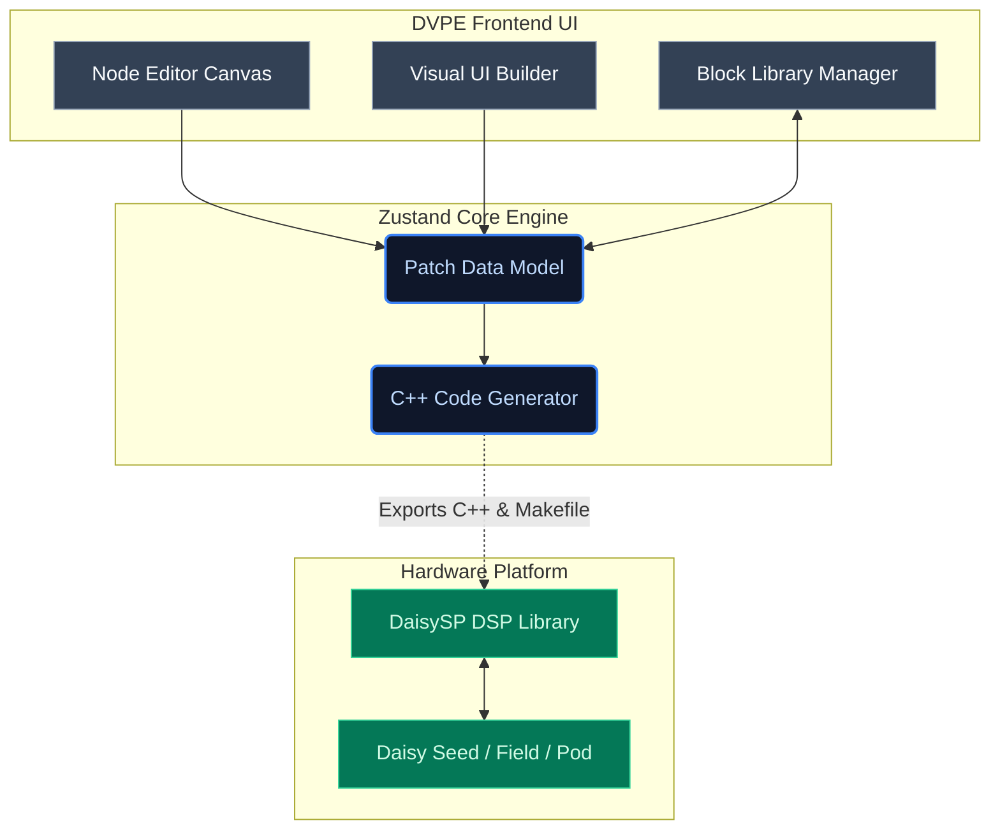
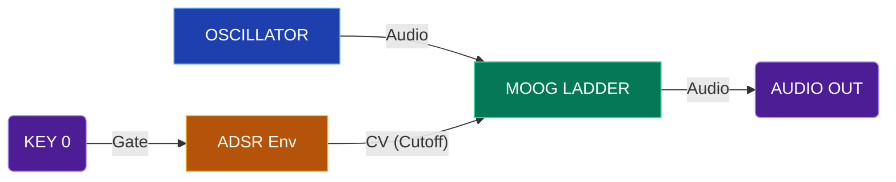

# DVPE - Daisy Visual Programming Environment

A visual block-based programming environment for creating audio patches on [Electro-Smith Daisy](https://www.electro-smith.com/) hardware. Design your synth with drag-and-drop blocks and export production-ready C++ code.


---

## Features

- **100+ Audio Blocks**: Oscillators, filters, effects, drums, physical modeling, and 40+ utility/math/logic primitives
- **Visual Patch Design**: Drag, connect, and configure blocks on an interactive canvas
- **Real-time Code Generation**: Export DaisySP-compatible C++ code
- **Daisy Field Target**: Optimized for Daisy Field hardware with knob/key/CV mappings
- **Visual UI Builder**: Design custom hardware layouts and visually bind UI controls directly to internal block parameters
- **🆕 Block Designer System**:
  - **Nested Block Editor**: Encapsulate block groups into reusable hierarchical components
  - **Hybrid Code Modules**: Embed standard TypeScript / C++ for optimization-critical routines
  - **Block Library Manager**: Easily export, import, structure, and reuse custom `.dvpe-block` and `.dvpe` patch files
- **Included Workflows**: Dedicated Chatbot integration and extensive skill libraries for seamless prompt-based generation (see `_block_diagrams_code/examples`)

---

## Architecture Overview



---

## Step-by-Step: Run DVPE

### Prerequisites

- Node.js 18+ ([download](https://nodejs.org/))
- npm (comes with Node.js)

### 1. Clone the Repository

```bash
git clone https://github.com/your-username/DVPE_Daisy-Visual-Programming-Environment.git
cd DVPE_Daisy-Visual-Programming-Environment
```

### 2. Install Dependencies

```bash
cd dvpe_CLD
npm install
```

### 3. Start Development Server

```bash
npm run dev
```

### 4. Open in Browser

Navigate to **<http://localhost:5173>** in your browser.

---

## Example Use: Create a Simple Synth

> **Looking for more?**
> We have included 5 complete starter examples (Beginner to Advanced) in the `_block_diagrams_code/examples/` folder. Each includes a full `Makefile`, C++ code, and the corresponding `.dvpe` patch file.



### Step 1: Add an Oscillator

1. In the **Block Library** (left panel), expand **Sources**
2. Drag **OSCILLATOR** onto the canvas
3. In the **Inspector** (right panel), set:
   - Frequency: `440` Hz
   - Waveform: `Saw`

### Step 2: Add a Filter

1. Drag **MOOG LADDER** from **Filters** onto the canvas
2. Connect the Oscillator's **OUT** port → Filter's **IN** port
3. Set filter cutoff to `1000` Hz

### Step 3: Add an Envelope

1. Drag **ADSR** from **Modulators** onto the canvas
2. Connect ADSR's **OUT** → MoogLadder's **CUTOFF CV** port
3. Set Attack: `0.01s`, Decay: `0.2s`, Sustain: `0.5`, Release: `0.3s`

### Step 4: Connect to Output

1. Drag **AUDIO OUTPUT** from **User I/O** onto the canvas
2. Connect MoogLadder's **OUT** → Audio Output's **LEFT** and **RIGHT**

### Step 5: Add a Trigger

1. Drag **KEY** from **User I/O** onto the canvas
2. Connect KEY's **GATE** → ADSR's **GATE** input
3. Set Key to `0` (first keyboard key on Daisy Field)

### Step 6: Export C++ Code

1. Click **Export C++** button in the toolbar
2. Download `main.cpp` and `Makefile`
3. Copy files to your Daisy project folder

### Step 7: Build & Flash

```bash
# In your Daisy project folder
make clean
make
make program-dfu
```

---

## Block Categories

| Category              | Blocks                                                                                        |
| --------------------- | --------------------------------------------------------------------------------------------- |
| **Sources**           | Oscillator, FM2, Particle, Grainlet, LFO, WhiteNoise, Dust                                    |
| **Filters**           | MoogLadder, SVF, OnePole, ATone                                                               |
| **Effects**           | Delay, Reverb, Chorus, Flanger, Overdrive, Wavefolder, Compressor, Limiter, Fold, DCBlock     |
| **Modulators**        | ADSR, AD Env                                                                                  |
| **Drums**             | HiHat, AnalogBassDrum, AnalogSnareDrum, SynthBassDrum, SynthSnareDrum                         |
| **Physical Modeling** | Drip, ModalVoice, StringVoice                                                                 |
| **Math**              | Add, Multiply, Subtract, Divide, Gain, Bypass                                                 |
| **Utility/Logic**     | VCA, LinearVCA, Mixer, Mux, Demux, SampleDelay, CvToFreq, and 40+ other primitives            |
| **User I/O**          | AudioInput, AudioOutput, Knob, Key, Encoder, GateTriggerIn, CVIn, GateOut, CVOut              |

---

## Project Structure

```text
DVPE_Daisy-Visual-Programming-Environment/
├── dvpe_CLD/                    # Main application
│   ├── src/
│   │   ├── components/          # React UI components (UI Builder, Canvas)
│   │   ├── core/blocks/         # Block definitions & configurations
│   │   ├── codegen/             # Native Daisy C++ code generator
│   │   └── store/               # Zustand state management
│   └── public/                  # Static assets
├── _block_diagrams_code/        # Exported blocks and standard examples
└── LICENSE                      # License file
```

---

## Development Commands

```bash
npm run dev      # Start dev server
npm run build    # Production build
npm test         # Run unit tests
npm run lint     # Lint code
```

---

## License

MIT License - See [LICENSE](LICENSE) for details.
