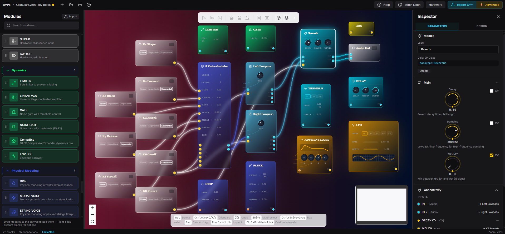

# DVPE — Daisy Visual Programming Environment

DVPE is a desktop-oriented visual editor for designing audio graphs and
exporting Daisy-oriented C++ project files. Build a patch from DSP, control,
math, and hardware blocks; edit it in the Inspector; save it as a `.dvpe`
project; then review the generated source in your normal Daisy toolchain.

> Current status: the React/Vite web editor is operational and tested. DVPE is
> not a firmware compiler, hardware flasher, or packaged desktop release.



The earlier Original Style design is retained for comparison:
[view the Field Additive Synth screenshot](docs/images/DVPE_Original_Field_Additive_Synth.png).

## Start on Windows

Prerequisite: [Node.js](https://nodejs.org/) 20 or newer.

1. Clone or download this repository.
2. Double-click **`START_DVPE.cmd`**.

On the first run, the launcher installs the exact locked dependencies. It then
starts DVPE at `http://127.0.0.1:1420/` and opens the browser. It does not need
administrator rights and installs nothing globally.

Manual start on Windows, macOS, or Linux:

```bash
git clone https://github.com/Denys/DVPE_Daisy-Visual-Programming-Environment.git
cd DVPE_Daisy-Visual-Programming-Environment/dvpe_CLD
npm ci
npm run dev -- --open
```

## What works now

- A catalog of 174 runtime blocks in 9 categories, with 329 parameters and
  227 CV-controllable parameters.
- Drag-and-drop patch authoring, validated connections, graph analysis,
  alignment tools, comments, and a Poly Voice Blanket canvas directive.
- Parameter editing, CV enablement, connectivity tracing, and design controls
  in the Inspector.
- Custom block creation, import/export, nested internals, reusable code
  modules, and port binding.
- `.dvpe` save/load, autosave recovery, recent projects, and embedded custom
  block definitions.
- Daisy-oriented C++, headers, and Makefile generation, downloaded as a ZIP.
- Hardware/Field mapping, conflict checks, polyphonic code paths, and an
  optional Advanced Export pass using a user-supplied AI API key.

Generated code is a starting point. Compile, inspect, test, and validate it on
the intended hardware before use.

## Three interface designs

DVPE currently provides exactly three selectable interface designs. Cycle
between them with the design button in the top bar.

| Design | Best suited to |
| --- | --- |
| **Original Style** | Dense patch editing and debugging, where restrained contrast and low visual complexity matter most. |
| **Stitch Neon** | Demos, presentations, and visually tracing signal flow through color-coded blocks and brighter connections. |
| **Experimentator** | Exploratory visual work and building a personal appearance with stronger glow, glass, and geometry controls. |

Stitch Neon and Experimentator are fine-tunable in **Inspector → Design**.
Changes are applied live, and both modes support saved presets. See the
[complete Block Diagram and Inspector guide](docs/user-guide/BLOCK_DIAGRAM_AND_INSPECTOR_GUIDE.md)
for the full workflow, controls, shortcuts, export steps, and troubleshooting.

## Current state

This snapshot was verified on **2026-09-01**:

| Area | Verified state |
| --- | --- |
| Automated tests | 883 tests pass across 46 files. |
| Static analysis | ESLint completes with no errors; 146 warnings remain as typed-cleanup and hook-dependency maintenance work. |
| Production build | TypeScript and Vite build complete successfully; Vite reports a large bundle chunk as open performance work. |
| Browser runtime | Module Library, Canvas, Inspector, design switching, save/load, Hardware, and export surfaces render at the fixed local URL. |
| Desktop packaging | Not included. The supported runtime is the browser application. |
| Firmware build/flash | Not included. Use an external Daisy firmware workspace after export. |
| Releases | No packaged installer or tagged release yet. |
| Dependency audit | `npm audit` reports 2 remaining advisories (1 low, 1 moderate), through Monaco/DOMPurify. Dependency maintenance remains open work. |

## Short history

The project began in January 2026 as a 76-block editor with a canvas,
Inspector, registry, state stores, and Daisy code generation. February added
custom blocks and nested internals. May added Field hardware mapping,
polyphonic generation, persistence, Neon design work, and a compact polyphonic
Grainlet workflow. July added reproducible dependency locking, tracked codegen
fixtures, and CI coverage. In September 2026 the public product description,
block catalog, GUI documentation, dependency lock, lint contract, and Windows
startup path were reconciled against the running application.

## Tutorials and documentation

| Start here | What it covers |
| --- | --- |
| [Block Diagram and Inspector guide](docs/user-guide/BLOCK_DIAGRAM_AND_INSPECTOR_GUIDE.md) | Complete GUI workflow: add, connect, edit, design, map hardware, save, and export. |
| [Daisy Field Mapping tutorial](dvpe_CLD/examples/field_mapping_subtractive_tutorial.md) | A guided subtractive-synth patch with knobs, keys, shift layers, conflicts, and C++ export. |
| [Glassmorphism design tutorial](dvpe_DESIGN/dvpe_glassmorphism_ai_guide.md) | A visual design study for tuning transparent blocks, wire glow, and readable UI chrome. |
| [Block catalog reference](docs/reference/DVPE_Diagram_Block_Reference.md) | The generated 174-block inventory, categories, parameters, ports, and intended uses. |
| [User guide index](docs/user-guide/README.md) | A compact entry point to all end-user documentation. |

## Development

Run from `dvpe_CLD/`:

```bash
npm ci
npm run dev
npm test -- --run
npm run build
npm run lint
```

The fixed development URL is `http://127.0.0.1:1420/`. If that port is already
used by another application, stop that application before launching DVPE.

## Repository scope

This repository is the original development base and retains its public
history, design studies, planning material, dashboards, and agent-support
files. Ignored local-only copies of `DaisyExamples/` and `noderr/` are not part
of a normal public clone. For a smaller product-only checkout without those
development layers, use the curated [DVPE sharing repository](https://github.com/Denys/DVPE).

## License

MIT License. See [LICENSE](LICENSE).
