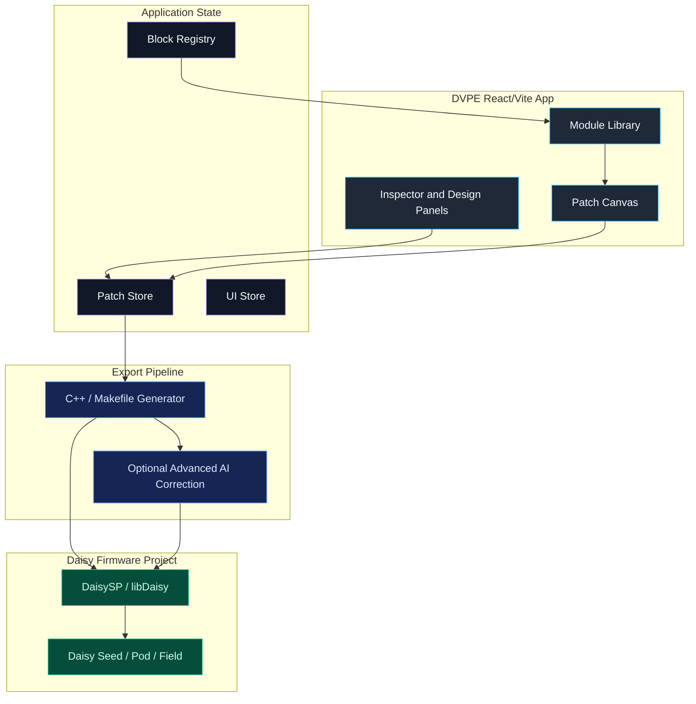
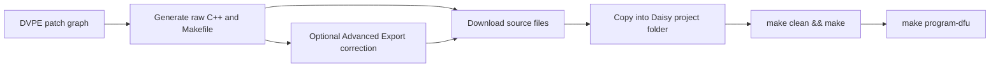

# DVPE - Daisy Visual Programming Environment

DVPE is a visual block-based programming environment for building audio
patches for [Electro-Smith Daisy](https://www.electro-smith.com/) hardware.
It lets you design a synth or effect as a node graph, configure blocks in an
inspector, and export Daisy-oriented C++ and Makefile output.


## What It Does

- Visual patch canvas for connecting audio, CV, trigger, and UI/control blocks.
- 173 built-in blocks across 9 categories, generated from the current
  `BlockRegistry`.
- Patch save, load, import, and export workflows for `.dvpe` projects and
  reusable custom blocks.
- Daisy-oriented C++ and Makefile generation for firmware projects.
- Custom and nested block workflows for reusable higher-level patch modules.
- Visual design modes, including original, glass, and experiment layouts.
- Experimental Advanced Export pass that can send generated code through an
  AI correction workflow before download.

For the full built-in block catalog, see
[DVPE Diagram Block Reference](dvpe_CLD/noderr/specs/DVPE_Diagram_Block_Reference.md).
That generated reference includes block descriptions, parameters, ranges,
defaults, and CV-controllable fields.

## How DVPE Fits Together


```mermaid
graph TD
    classDef ui fill:#1f2937,stroke:#38bdf8,color:#f8fafc;
    classDef state fill:#111827,stroke:#a78bfa,color:#f8fafc;
    classDef export fill:#172554,stroke:#60a5fa,color:#dbeafe;
    classDef firmware fill:#064e3b,stroke:#34d399,color:#d1fae5;

    subgraph App["DVPE React/Vite App"]
        Canvas["Patch Canvas"]:::ui
        Inspector["Inspector and Design Panels"]:::ui
        Library["Module Library"]:::ui
    end

    subgraph Stores["Application State"]
        PatchStore["Patch Store"]:::state
        UIStore["UI Store"]:::state
        BlockRegistry["Block Registry"]:::state
    end

    subgraph Output["Export Pipeline"]
        Codegen["C++ / Makefile Generator"]:::export
        Advanced["Optional Advanced AI Correction"]:::export
    end

    subgraph Daisy["Daisy Firmware Project"]
        DaisySP["DaisySP / libDaisy"]:::firmware
        Hardware["Daisy Seed / Pod / Field"]:::firmware
    end

    Library --> Canvas
    Inspector --> PatchStore
    Canvas --> PatchStore
    BlockRegistry --> Library
    PatchStore --> Codegen
    Codegen --> Advanced
    Codegen --> DaisySP
    Advanced --> DaisySP
    DaisySP --> Hardware
```

## Quick Start

The web development version is the simplest way to run DVPE.

### Prerequisites

- Node.js 20+ recommended
- npm, included with Node.js

### Run In Browser

```bash
git clone https://github.com/Denys/DVPE_Daisy-Visual-Programming-Environment.git
cd DVPE_Daisy-Visual-Programming-Environment/dvpe_CLD
npm install
npm run dev
```

Open:

```text
http://localhost:1420
```

If port `1420` is already in use, stop the other process first. The Vite config
uses a fixed port because the optional Tauri desktop path expects it.

### Optional Desktop Mode

Desktop mode uses Tauri and is optional. Install Rust and the Tauri toolchain,
then run:

```bash
cd dvpe_CLD
npm run tauri:dev
```

The browser version is the recommended first run path.

## Patch-To-Firmware Export

DVPE exports a patch graph into Daisy-oriented source files. The generated
output should be reviewed before it is flashed to real hardware.


```mermaid
flowchart LR
    Patch["DVPE patch graph"] --> Preview["Generate raw C++ and Makefile"]
    Preview --> Download["Download source files"]
    Preview --> AI["Optional Advanced Export correction"]
    AI --> Download
    Download --> Project["Copy into Daisy project folder"]
    Project --> Build["make clean && make"]
    Build --> Flash["make program-dfu"]
```

Advanced Export is experimental. It requires a user-provided API key in the
browser and can call external AI providers. Treat its output as a review aid,
not as an automatic guarantee that firmware is ready for hardware.

## Example Patch

This is the basic signal shape of a simple synth patch: a note or key trigger
drives an envelope, the oscillator feeds a filter, and the filtered signal goes
to stereo output.


```mermaid
graph LR
    classDef source fill:#0f766e,stroke:#5eead4,color:#ecfeff;
    classDef filter fill:#1d4ed8,stroke:#93c5fd,color:#eff6ff;
    classDef mod fill:#92400e,stroke:#fbbf24,color:#fff7ed;
    classDef io fill:#166534,stroke:#86efac,color:#f0fdf4;

    Key["KEY or MIDI NOTE"]:::io -- Gate --> ADSR["ADSR ENVELOPE"]:::mod
    Osc["OSCILLATOR"]:::source -- Audio --> Filter["MOOG LADDER or SVF"]:::filter
    ADSR -- "CV modulation" --> Filter
    Filter -- Audio --> Out["AUDIO OUTPUT"]:::io
```

Typical workflow:

1. Drag blocks from the module library onto the canvas.
2. Connect audio, CV, trigger, and control ports.
3. Edit block parameters in the Inspector.
4. Save the patch as a `.dvpe` file.
5. Export generated C++ and Makefile output.
6. Review, build, and flash in a Daisy firmware project.

## Block Reference

The current generated block reference reports:

| Area | Count |
| --- | ---: |
| Built-in blocks | 173 |
| Categories | 9 |
| Parameters | 320 |
| CV-controllable parameters | 221 |

Use the generated
[DVPE Diagram Block Reference](dvpe_CLD/noderr/specs/DVPE_Diagram_Block_Reference.md)
for the authoritative block list. It is better than a static README table
because it is generated from `dvpe_CLD/src/core/blocks/BlockRegistry.ts` and
the block definition files.

## Development Commands

Run these from `dvpe_CLD/`.

```bash
npm run dev            # Start Vite on http://localhost:1420
npm run build          # TypeScript check and production build
npm test               # Run Vitest
npm run test:coverage  # Run Vitest with coverage
npm run lint           # Lint source files
npm run tauri:dev      # Optional desktop development mode
npm run tauri:build    # Optional desktop build
```

## Repository Map

```text
DVPE_Daisy-Visual-Programming-Environment/
  dvpe_CLD/          Main React/Vite/Tauri DVPE application
  DaisyExamples/     Daisy firmware workspace and examples
  dvpe_DESIGN/       Design studies, screenshots, and visual prototypes
  docs/plans/        Planning and design documents
  noderr/            Primary project specification and memory surface
  .agent/            Legacy agent workflows and support assets
  LICENSE            Project license
```

For application work, start in `dvpe_CLD/`. For firmware work, use
`DaisyExamples/` and its local documentation.

## Current Caveats

- The generated firmware path is intended for Daisy-oriented projects and
  should be reviewed before flashing hardware.
- Advanced Export is experimental, requires API keys, and may call external AI
  providers.
- The web app is the most direct launch target. Desktop/Tauri mode is optional
  and requires additional setup.
- Some design assets and planning files are included because this repository is
  also used as an active development workspace.

## License

MIT License. See [LICENSE](LICENSE).
