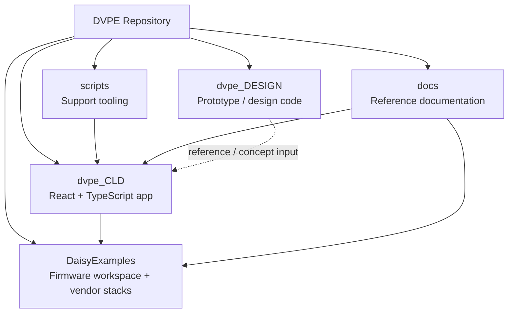
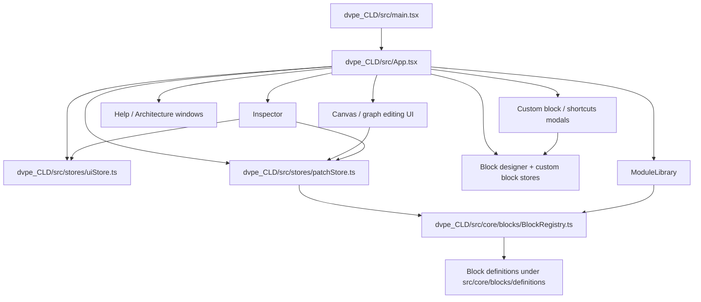
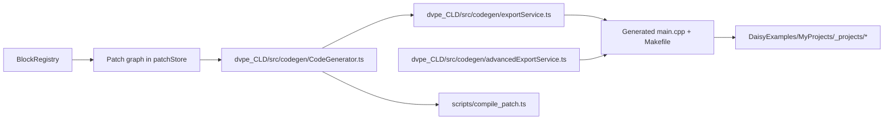
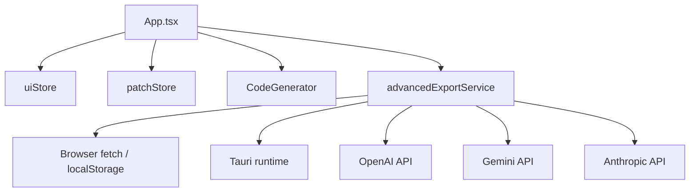
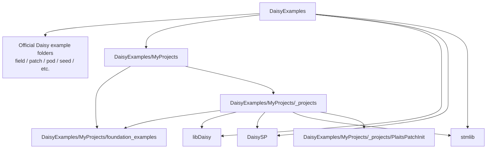
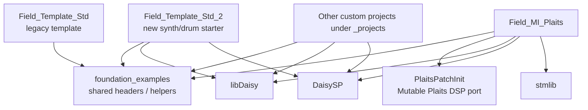
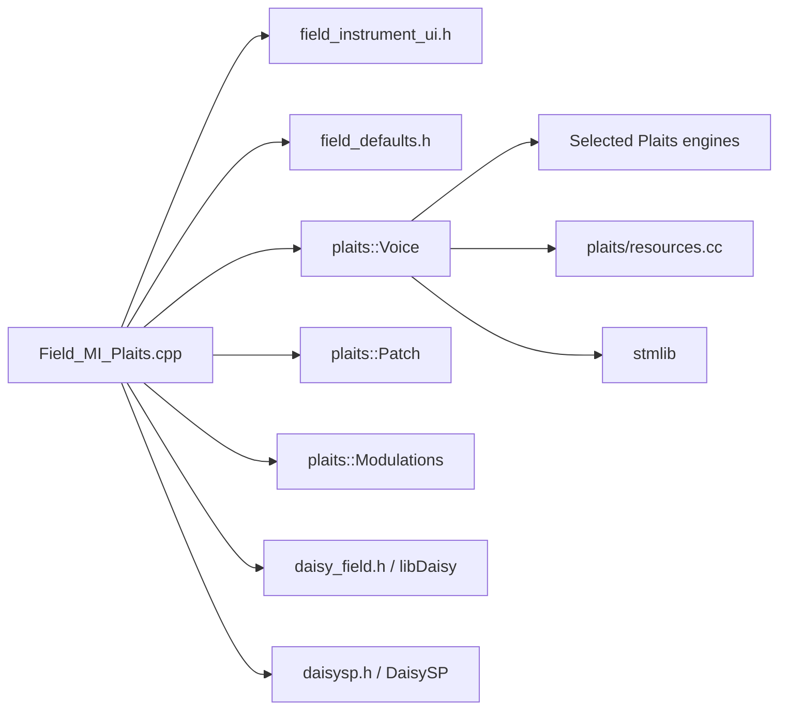
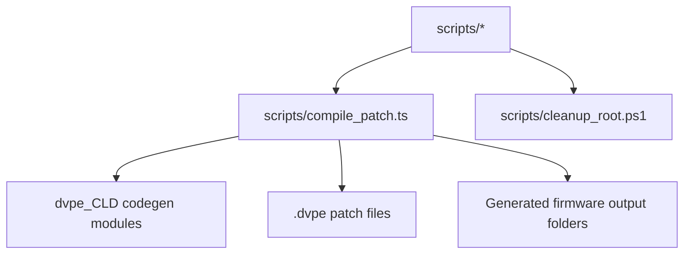
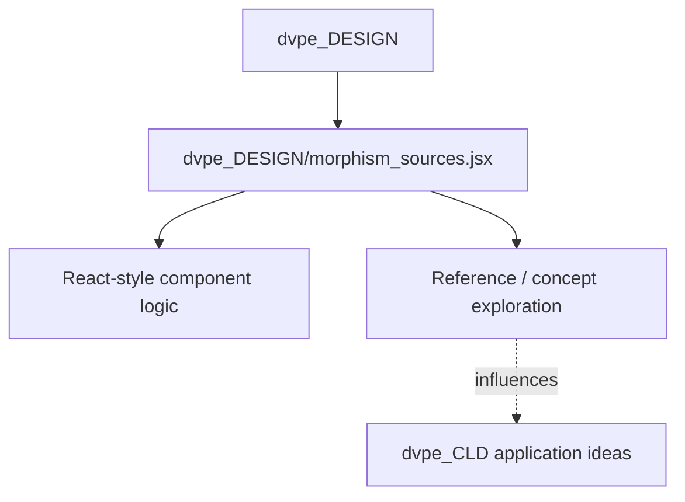
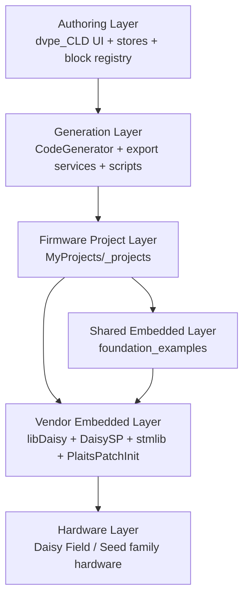

# Total Code Dependencies

This document tracks the main code dependencies across the entire repository.

Scope:
- This is a repo-wide architectural dependency map for the code-bearing areas of the project.
- It covers the main application, code generation pipeline, firmware workspace, shared firmware helpers, support scripts, and prototype/design code.
- It is not a literal per-file include graph for every source file in the tree.
- For deeper project-specific detail, use local dependency docs such as [DaisyExamples/MyProjects/_projects/Field_MI_Plaits/Dependencies.md](DaisyExamples/MyProjects/_projects/Field_MI_Plaits/Dependencies.md).

## 1. Repository Domain Graph

## 2. DVPE Frontend Architecture

## 3. Code Generation And Export Flow

## 4. Frontend Runtime + AI Export Dependencies

## 5. Firmware Workspace Graph

## 6. MyProjects Dependency Graph

## 7. Field_MI_Plaits Deep Dependency Position

## 8. Script And Tooling Dependencies

## 9. Design / Prototype Code Dependencies

## 10. Dependency Layers

## 11. Notes

- `dvpe_CLD` is the primary authoring environment. Its key internal dependency spine is `App.tsx -> stores -> BlockRegistry -> CodeGenerator`.
- `patchStore` is the main ownership point for patch graph state, and `BlockRegistry` is the canonical registry for block definitions used by both editing and generation flows.
- `scripts/compile_patch.ts` is an important cross-boundary dependency: it uses frontend codegen logic without running the browser UI.
- `DaisyExamples/MyProjects` is the main custom firmware workspace. Shared helpers live in `foundation_examples`, while actual firmware targets live in `_projects`.
- `Field_MI_Plaits` is the deepest dependency node currently in `MyProjects` because it layers Field UI helpers, libDaisy, DaisySP, stmlib, and the vendored Mutable Plaits port together.
- `dvpe_DESIGN` appears to be adjacent prototype/reference code rather than the main runtime path for the app.
- `docs` influences implementation choices and onboarding, but it is not a runtime dependency domain by itself.

## 12. Update Triggers

Update this document when:
- a new top-level code domain is added to the repository
- the frontend state/codegen architecture changes materially
- new scripts start importing app modules directly
- new shared firmware helper layers are introduced
- the vendor stack changes, especially `libDaisy`, `DaisySP`, `stmlib`, or `PlaitsPatchInit`
- a project-specific dependency doc is added that should be linked from here
