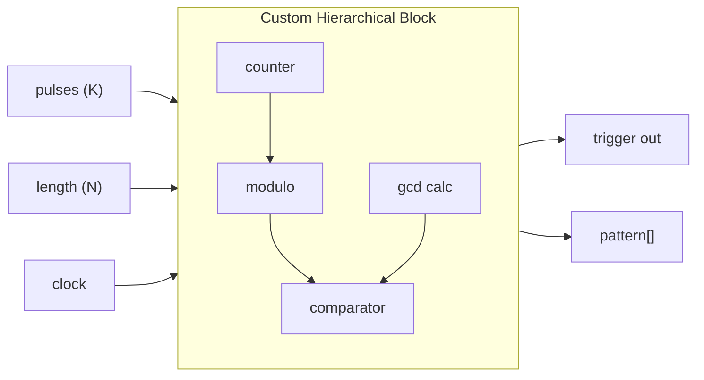

# Block Designer Architecture

**Status**: 🚀 ACTIVE CORE  
**Created**: 2026-01-28  
**Parent Document**: [Phase13_Block_Diagram_Designer.md](PLANNING/phases/Phase13_Block_Diagram_Designer.md)

---

## Architectural Philosophy

> "No development team can anticipate every block users will require for their specific creative and technical workflows."

The Block Designer is **not** an optional extension—it is a fundamental architectural element of DVPE. Every system component must provide first-class support for custom blocks equivalent to factory-provided primitives.

---

## Block Categories

### 1. Algorithmic Blocks
Novel computational processes not in the primitive library:
- Euclidean rhythm generation
- Probability distributions
- Stochastic sequence generators
- Waveshaping functions
- Spectral analysis routines
- Mathematical transformations

### 2. Hierarchical Blocks
Composite structures encapsulating multiple functional units:
- Synth Voice (Osc → Filter → Env → VCA)
- Generative Sequencer (Clock → Pattern → Gate)
- FX Chain (Delay → Reverb → Limiter)

---

## Utility Block Library

### Arithmetic
| Block | Function |
|-------|----------|
| `add` | Sum two signals |
| `subtract` | Difference |
| `multiply` | Product |
| `divide` | Quotient |
| `modulo` | Remainder |
| `abs` | Absolute value |
| `sign` | Sign extraction (-1/0/+1) |
| `min` | Minimum of two |
| `max` | Maximum of two |
| `clamp` | Constrain to range |

### Mathematical
| Block | Function |
|-------|----------|
| `pow` | Power (x^y) |
| `sqrt` | Square root |
| `log` | Natural logarithm |
| `exp` | Exponential |
| `sin` / `cos` / `tan` | Trigonometric |
| `atan2` | Two-argument arctangent |
| `lerp` | Linear interpolation |
| `map` | Range mapping |

### Calculus
| Block | Function |
|-------|----------|
| `derivative` | Finite difference |
| `integral` | Accumulator with reset |
| `moving_average` | Windowed summation |

### Logic & Stateful
| Block | Function |
|-------|----------|
| `comparator` | >, <, ==, !=, >=, <= |
| `and` / `or` / `not` / `xor` | Boolean ops |
| `sample_hold` | Sample and hold |
| `delay_line` | N-sample delay |
| `ring_buffer` | Circular buffer |
| `counter` | Up/down with wrap |
| `toggle` | Flip-flop |
| `state_machine` | FSM primitives |

### Signal Routing
| Block | Function |
|-------|----------|
| `splitter` | 1 → N outputs |
| `merger` | N → 1 (sum) |
| `crossfade` | Blend two signals |
| `selector` | Choose 1 of N |
| `matrix_router` | N×M routing |

### Transformations
| Block | Function |
|-------|----------|
| `scale` | Multiply by constant |
| `offset` | Add constant |
| `range_map` | [A,B] → [C,D] |
| `quantize` | Nearest step |
| `rate_convert` | Audio ↔ Control |

---

## Hierarchical Block System

### Creation Flow
1. User selects multiple blocks on canvas
2. Click "Create Block from Selection"
3. Define input/output ports
4. Name and save to library

### Nested Editing
- Double-click to enter hierarchical block
- Breadcrumb navigation for nested depth
- Changes propagate to all instances

---

## Hybrid Code Modules

For optimization-critical routines:

```typescript
// Example: Euclidean rhythm generator
interface EuclideanBlock {
  inputs: {
    pulses: number;  // K
    length: number;  // N
    rotation: number;
    clock: trigger;
  };
  outputs: {
    trigger: trigger;
    pattern: number[];
  };
  
  // Embedded TypeScript
  process(inputs) {
    // GCD-based Bjorklund algorithm
    return euclidean(inputs.pulses, inputs.length, inputs.rotation);
  }
}
```

---

## System Integration Requirements

Every DVPE component must support custom blocks:

| Component | Requirement |
|-----------|-------------|
| **Block Registry** | Register custom blocks alongside factory blocks |
| **Canvas Renderer** | Render custom block nodes with user-defined ports |
| **Code Generator** | Generate C++ for custom blocks (inline or class wrapper) |
| **Serialization** | Save/load custom block definitions in `.dvpe` |
| **Validation** | Validate custom block connections type-safely |
| **Inspector** | Display custom block parameters |

---

## Example: Building Euclidean Generator

**Without Block Designer**: Impossible—no `euclidean_gen` block exists.

**With Block Designer** (using utility primitives):



**Result**: Algorithm creation through visual composition without C++ coding.
