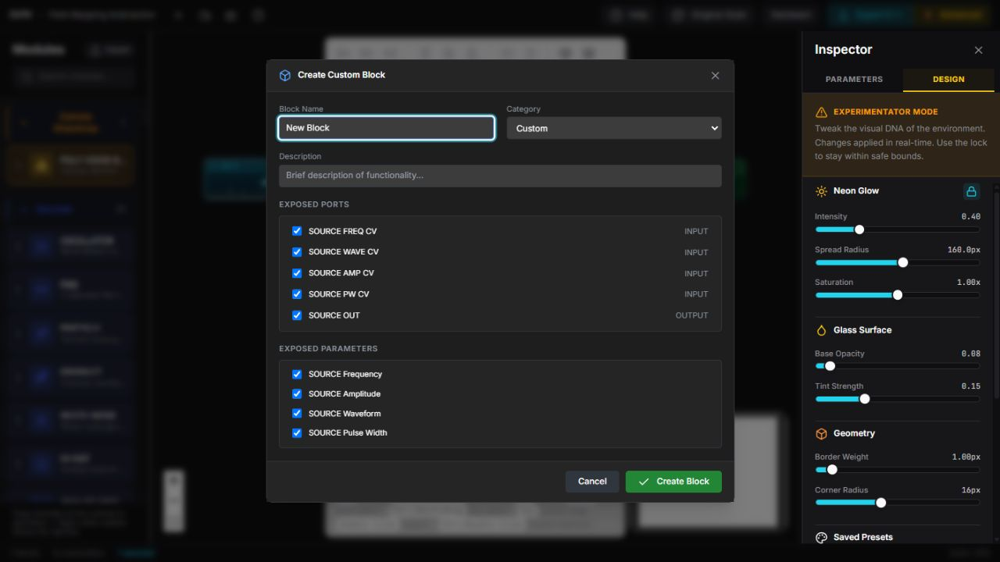

# Tutorial: Create and Reuse a Custom Block

**Goal:** Turn a useful selection of blocks into one reusable library item.

**Time:** 15–20 minutes.

**Result:** A custom block with a controlled public interface that can travel as
a `.dvpe-block` file.

*The dialog is generated from the selected graph. Only checked ports and
parameters become part of the custom block's public interface.*

## 1. Build and test the subgraph

Start with a small route whose purpose is easy to name, such as an oscillator
feeding a filter. Connect it normally and use **Inspector → Parameters** and
**Connectivity** to verify the internal signal route before packaging it.

A custom block hides internal detail, so fix unclear or invalid connections
first. Expose only controls a future patch actually needs.

## 2. Select the internal blocks

1. Hold `Shift` and select every block that belongs inside the reusable unit.
2. Confirm that unrelated output, hardware, or control blocks are not selected.
3. Select **Create Custom Block** in the floating alignment toolbar.

The command becomes available when a groupable multi-selection exists.

## 3. Define the public interface

In **Create Custom Block**:

1. Enter a descriptive **Block Name**.
2. Choose **Custom**, **Sources**, **Effects**, or **Utility** as its category.
3. Add a short description that states the block's purpose.
4. Under **Exposed Ports**, keep only inputs and outputs that the outer graph
   must connect.
5. Under **Exposed Parameters**, keep only values a user should edit from the
   outer Inspector.
6. Select **Create Block**.

A small, deliberate interface is easier to reuse than exposing every internal
port and parameter.

## 4. Inspect and edit the custom block

- Double-click the outer custom block to inspect its public parameters.
- Use `Ctrl/Cmd + Double-click` to open its internal graph.
- Press `Ctrl/Cmd + U` to toggle the **Block UI Designer** for supported custom
  block work.
- From the custom-block editor, use **C++ Code** for reusable code modules and
  **Port Bindings** to connect module variables to block ports.

Port bindings should match direction and signal type. DVPE reports validation
state in the code-module editor; resolve reported errors before exporting.

## 5. Duplicate, export, or remove

Find the custom block in the Module Library and right-click it:

- **Edit** reopens its definition.
- **Duplicate** creates a separate starting point for a variation.
- **Export as `.dvpe-block`** downloads a portable definition.
- **Delete** removes the library definition from local browser storage. Save or
  export anything you need before deleting it.

Custom block definitions used by a saved project are also embedded in the
`.dvpe` file so that the project can restore them.

## 6. Import into another browser profile or checkout

1. Select **Import** at the top of the Module Library.
2. Drop the `.dvpe-block` file onto the dialog, or browse for it.
3. Review the parsed name, category, ports, and parameters.
4. If the ID already exists, choose the dialog's appropriate duplicate handling
   option rather than silently replacing a block you still need.
5. Complete the import and drag the new block onto a test Canvas.

Connect every public input and output once, inspect its parameters, and export a
small test project before relying on the block in a larger design.

## Completion check

- The library contains the new custom block.
- Its outer ports and parameters match the intended public interface.
- `Ctrl/Cmd + Double-click` opens the expected internals.
- The exported `.dvpe-block` imports into a clean context.
- Generated C++ is still reviewed and compiled externally; editor validation is
  not hardware validation.

Next: [inspect, map hardware, and export](INSPECTOR_HARDWARE_AND_EXPORT.md),
[tune the interface design](DESIGN_MODES_AND_VISUAL_TUNING.md), or consult the
[Block Diagram and Inspector guide](../user-guide/BLOCK_DIAGRAM_AND_INSPECTOR_GUIDE.md).
