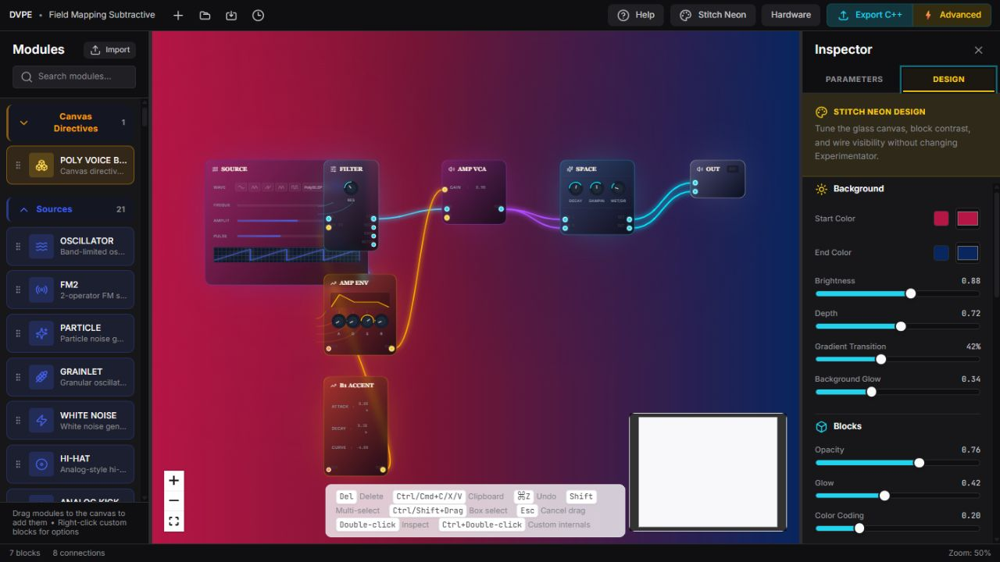
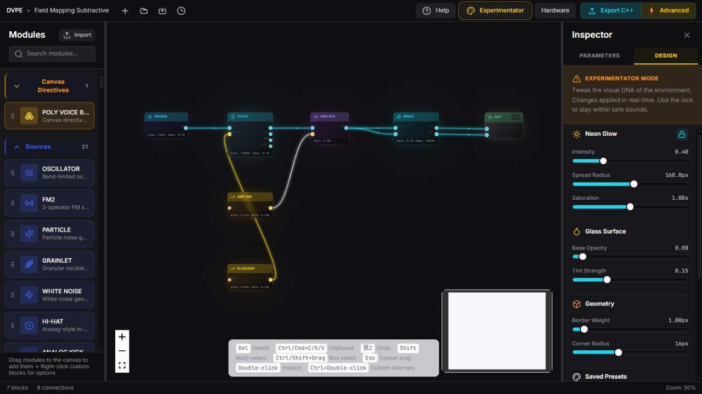
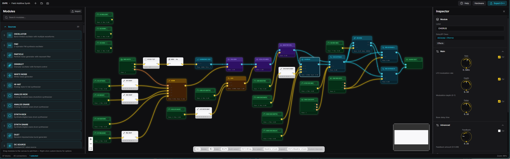

# Tutorial: Design Modes and Visual Tuning

**Goal:** Choose the interface design that fits the task and save a readable
visual preset.

**Time:** About 10 minutes.

**Result:** A tuned Stitch Neon or Experimentator preset without changing the
DSP graph.

DVPE currently has exactly three interface designs:

| Design | Most suitable for |
| --- | --- |
| **Original Style** | Dense construction, long editing sessions, and debugging with restrained visual decoration. |
| **Stitch Neon** | Demonstrations, presentations, and tracing color-coded signal routes with brighter wires. |
| **Experimentator** | Personal visual exploration, stronger glow/glass styling, and dramatic presentation layouts. |

Use the design button in the top bar to cycle through them. Design settings
change editor appearance only; they do not change graph data, DSP behavior, or
generated algorithms.

## Tune Stitch Neon

1. Cycle the top-bar button to **Stitch Neon**.
2. Open **Inspector → Design**.
3. Adjust the background gradient, brightness, depth, transition, and glow.
4. Adjust block opacity, glow, color coding, borders, corners, and block-type
   colors.
5. Adjust wire width, glow, and opacity while checking both audio and CV routes.
6. Save a named preset when labels, ports, and wires remain readable at the zoom
   level you normally use.

Stitch Neon is the better starting point when signal visibility matters more
than visual experimentation.

## Tune Experimentator

1. Cycle the top-bar button to **Experimentator**.
2. Keep the safety lock enabled for ordinary use.
3. Open **Inspector → Design**.
4. Adjust neon intensity, spread, and saturation.
5. Adjust glass base opacity and tint strength.
6. Adjust border weight and corner radius.
7. Save a named preset, then test it on both a small graph and a dense graph.

Experimentator intentionally permits more extreme styling. If the graph becomes
hard to read, use **Reset Experimentator** or return to Original Style.

## Compare against Original Style

Original Style uses the stable default appearance and does not need fine-tuning.
Use it as a readability baseline before accepting a custom preset.

## Preset acceptance check

At normal zoom, confirm that:

- every block label and parameter summary is legible;
- unconnected, connected, and CV-enabled ports remain distinguishable;
- audio, CV, and trigger connections can be followed across the graph;
- selected blocks and Inspector focus are obvious;
- the minimap and alignment toolbar do not disappear into the background.

If any item fails, reduce glow/transparency or increase contrast before saving.

Next: [build a first patch](GETTING_STARTED_FIRST_PATCH.md), explore the
[Daisy Field Mapping tutorial](../../dvpe_CLD/examples/field_mapping_subtractive_tutorial.md),
review [Inspector, Hardware, and Export](INSPECTOR_HARDWARE_AND_EXPORT.md),
or read the [complete GUI guide](../user-guide/BLOCK_DIAGRAM_AND_INSPECTOR_GUIDE.md).
