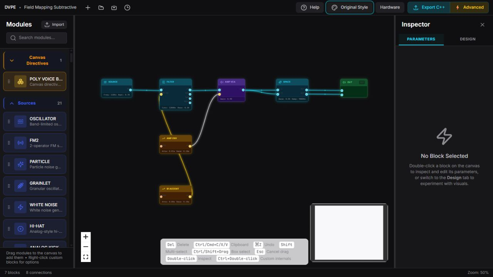

# Tutorial: Build Your First DVPE Patch

**Goal:** Build, inspect, save, reopen, and export a small audio graph.

**Time:** About 10 minutes.

**Result:** A `.dvpe` project containing `OSCILLATOR → VCA → AUDIO OUTPUT`.



*The included Field Mapping example is larger than this first patch, but it
shows the same left-to-right source → processing → output structure.*

## 1. Start DVPE

On Windows, double-click `START_DVPE.cmd` in the repository root. The first run
installs the locked dependencies, starts the editor at
`http://127.0.0.1:1420/`, and opens it in the browser.

On Windows, macOS, or Linux you can instead run:

```bash
cd dvpe_CLD
npm ci
npm run dev -- --open
```

The window has three working areas:

- **Module Library** on the left: search and drag blocks.
- **Canvas** in the center: arrange blocks and connect compatible ports.
- **Inspector** on the right: edit the selected block's parameters,
  connectivity, and appearance.

## 2. Add three blocks

1. Select **New** in the top bar if another patch is open.
2. Search for `OSCILLATOR` and drag it to the left side of the Canvas.
3. Search for `VCA` and place it to the right of the oscillator.
4. Search for `AUDIO OUTPUT` and place it at the far right.

The library category is only an organizational aid: `OSCILLATOR` is under
Sources, `VCA` under Utility, and `AUDIO OUTPUT` under User I/O.

## 3. Connect the signal path

Drag from an output port to a compatible input port:

1. `OSCILLATOR.OUT` → `VCA.IN`
2. `VCA.OUT` → `AUDIO OUTPUT.L`
3. `VCA.OUT` → `AUDIO OUTPUT.R`

Audio ports use cyan. CV ports use yellow, and trigger/gate ports use orange.
DVPE rejects incompatible connections. Drag an existing wire endpoint to
reroute it, or select a wire and press `Delete` to remove it.

## 4. Inspect and edit

1. Double-click `OSCILLATOR` to open it in **Inspector → Parameters**.
2. Set **Frequency** to a moderate value such as `220 Hz` and keep **Amplitude**
   conservative.
3. Inspect `VCA` and set **Gain** below full scale while learning the export
   workflow.
4. Expand **Connectivity** to confirm each input and output destination.

When a parameter supports CV, its **CV** checkbox exposes the matching CV input
on the block. For example, enabling oscillator Frequency CV makes modulation
possible without changing the stored base value.

The browser editor authors the graph; it does not replace target compilation or
hardware listening tests.

## 5. Arrange and navigate

- Drag a block by its body to move it.
- Hold `Shift` to select multiple blocks, or use box selection.
- Use the floating alignment toolbar for clean rows and spacing.
- Use the bottom-left controls to zoom or fit the whole graph.
- Press `Ctrl/Cmd + Z` to undo.

## 6. Save and reopen

1. Select **Save** or press `Ctrl/Cmd + S`.
2. Keep the downloaded `.dvpe` file in a project folder you control.
3. Select **Open** or press `Ctrl/Cmd + O`, then choose the saved file.
4. Confirm that all three blocks and all connections return.

DVPE also keeps local autosave and recent-project metadata, but the downloaded
`.dvpe` file is the portable project copy.

## 7. Export the source package

Select **Export C++**, review the preview, and download the ZIP. In the browser
build it contains Daisy-oriented C++ source and a Makefile. Treat this as
generated source: review it, compile it in the appropriate Daisy toolchain, and
validate the result on the intended hardware before depending on it. The
[Inspector, Hardware, and Export tutorial](INSPECTOR_HARDWARE_AND_EXPORT.md)
covers the complete review and optional Advanced Export workflow.

## Completion check

- The Canvas shows three blocks and three wires.
- Inspector Connectivity lists the expected route.
- The `.dvpe` file reopens correctly.
- Export produces a ZIP, with no claim yet that it has compiled or run on
  hardware.

Next: [inspect, map hardware, and export](INSPECTOR_HARDWARE_AND_EXPORT.md),
[map controls to Daisy Field](../../dvpe_CLD/examples/field_mapping_subtractive_tutorial.md),
[package a reusable custom block](CUSTOM_BLOCKS_AND_REUSE.md), or read the
[complete GUI guide](../user-guide/BLOCK_DIAGRAM_AND_INSPECTOR_GUIDE.md).
