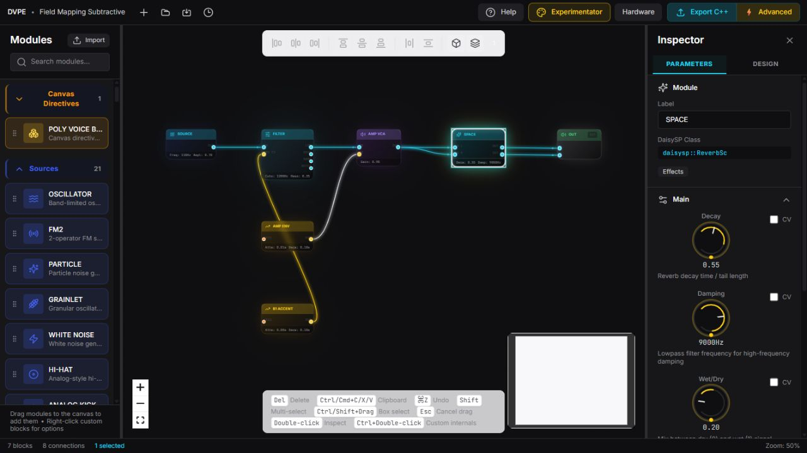
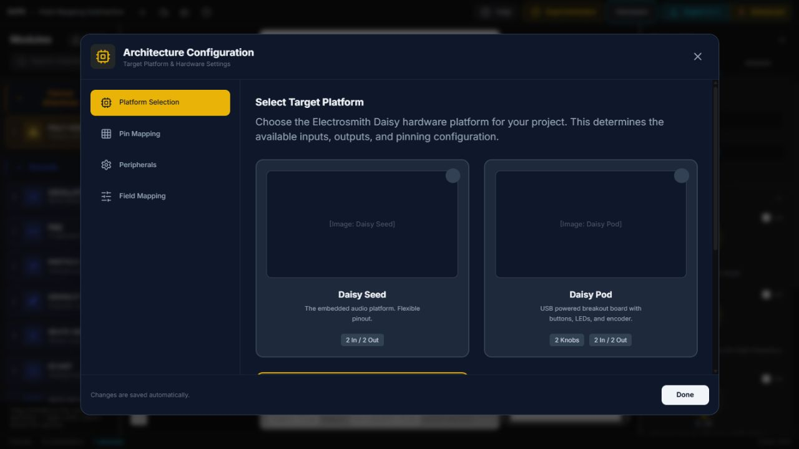
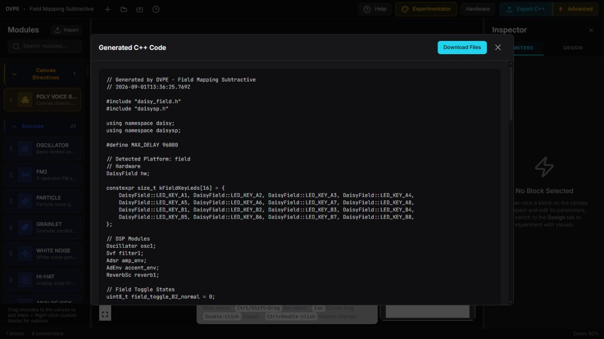
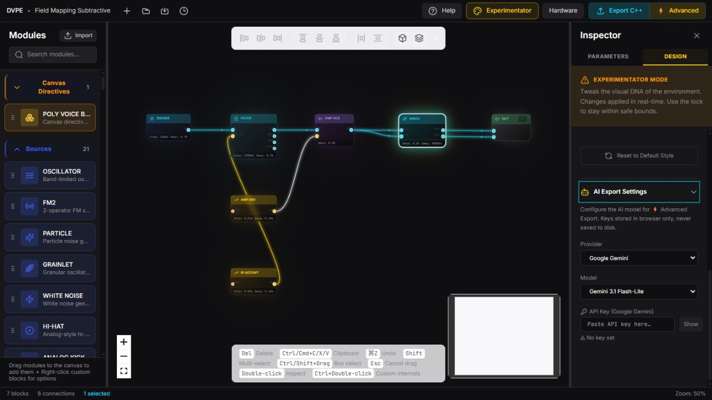

# Tutorial: Inspect, Map Hardware, and Export

**Goal:** Verify a patch in the Inspector, choose its Daisy target, and compare
standard and Advanced Export without confusing generated source with verified
firmware.

**Time:** 15–20 minutes.

**Result:** A saved `.dvpe` project, a reviewed hardware configuration, and a
downloadable C++/Makefile package ready for an external Daisy toolchain.

You can use any patch. For a repeatable example, open
`dvpe_CLD/examples/field_mapping_subtractive.dvpe`.

## 1. Inspect the graph before export

Double-click a block to open **Inspector → Parameters**. Work from top to
bottom:

1. **Module** — give repeated modules clear labels and confirm the shown
   DaisySP class or implementation identity.
2. **Parameter groups** — edit knobs, switches, waveforms, envelopes, or
   selectors. These are the values saved in the project and consumed by code
   generation.
3. **CV checkboxes** — enable CV only where modulation is required. Enabling a
   checkbox exposes the matching input on the block; disabling it removes that
   active modulation port.
4. **Connectivity** — confirm every required input has a source and every
   output reaches the intended processor or hardware output.
5. **Documentation** — expand the block-specific notes when a control or port
   is unclear.

The Inspector distinguishes audio, CV, and trigger routes and names connected
blocks. A visible connection proves that the editor accepted the route; it does
not prove that the generated firmware compiles or sounds correct.

## 2. Configure Hardware

Select **Hardware** in the top bar. Changes in this window are stored with the
project automatically.

Use the four tabs in order:

1. **Platform Selection** — choose Daisy Seed, Pod, or Field. This updates the
   target stored in the project and used by export.
2. **Pin Mapping** — map the graph's logical hardware roles to physical pins.
   Remove stale assignments instead of leaving two roles on one pin.
3. **Peripherals** — configure the peripherals needed by the patch and check
   their assigned resources.
4. **Field Mapping** — when targeting Daisy Field, map K1–K8 and A1–B8 to block
   parameters without adding control blocks to the audio graph.

Use the dedicated
[Daisy Field Mapping tutorial](../../dvpe_CLD/examples/field_mapping_subtractive_tutorial.md)
for layered normal and held-switch mappings. Editor conflict checks are useful,
but the board revision, electrical connections, pin definitions, and control
behavior still require external verification.

## 3. Run standard Export C++

1. Save the `.dvpe` project with a meaningful name.
2. Select **Export C++**.
3. Read the preview before downloading. Check the target header, platform
   comment, DSP declarations, audio callback, and block initialization.
4. If the preview reports errors, return to the graph and resolve them.
5. Select **Download Files**. In the browser build, DVPE creates a ZIP containing
   `<project-name>.cpp` and `Makefile`.

The download dialog can save the diagram first and derive the source filename
from the project name. Choosing not to save uses `default_project`.

Move the ZIP contents into a compatible libDaisy/DaisySP workspace, then build,
inspect warnings, flash, and test on the target. Those toolchain and hardware
steps are outside this repository.

## 4. Configure Advanced Export

Advanced Export is optional. It sends the generated C++ and Makefile to a
selected external AI provider for an experimental correction pass.

1. Switch the top-bar design to **Experimentator**.
2. Open **Inspector → Design**.
3. Scroll to and expand **AI Export Settings**.
4. Choose the provider and model.
5. Enter that provider's API key only in a trusted browser profile. The key is
   stored in browser storage and is not included in the downloaded project.
6. Select **Advanced** in the top bar.
7. When processing succeeds, compare **Raw (DVPE)** and **AI Corrected** in the
   preview before downloading.

The screenshot intentionally shows **No key set**. Never publish a screenshot,
project, or browser profile that exposes an API key.

Advanced Export is not a certification step. The external model can introduce
wrong APIs or remove required behavior. Diff its result against standard
export, then run the same compiler, target, audio, and hardware checks.

## Completion check

- Inspector labels, parameters, CV inputs, and Connectivity match the intended
  signal flow.
- Hardware stores the intended platform and contains no known mapping conflict.
- Standard Export identifies that platform and downloads C++ plus a Makefile.
- Advanced Export is either deliberately skipped or configured without
  exposing credentials.
- No generated result is described as compiled, flashed, or hardware-verified
  until those external checks actually pass.

Next: [build a first patch](GETTING_STARTED_FIRST_PATCH.md),
[map Daisy Field controls](../../dvpe_CLD/examples/field_mapping_subtractive_tutorial.md),
[create a reusable custom block](CUSTOM_BLOCKS_AND_REUSE.md), or
[tune the interface design](DESIGN_MODES_AND_VISUAL_TUNING.md).
