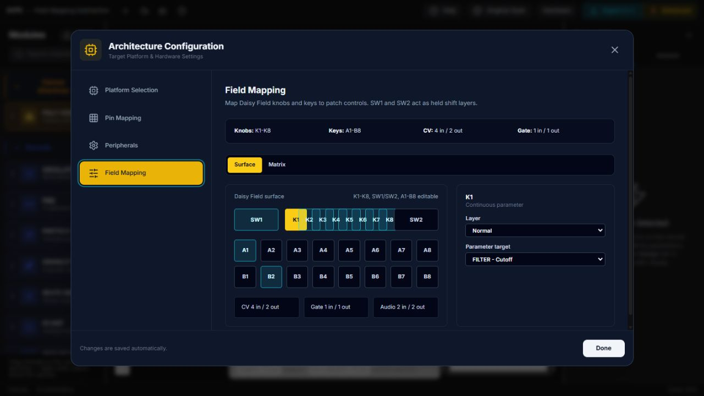
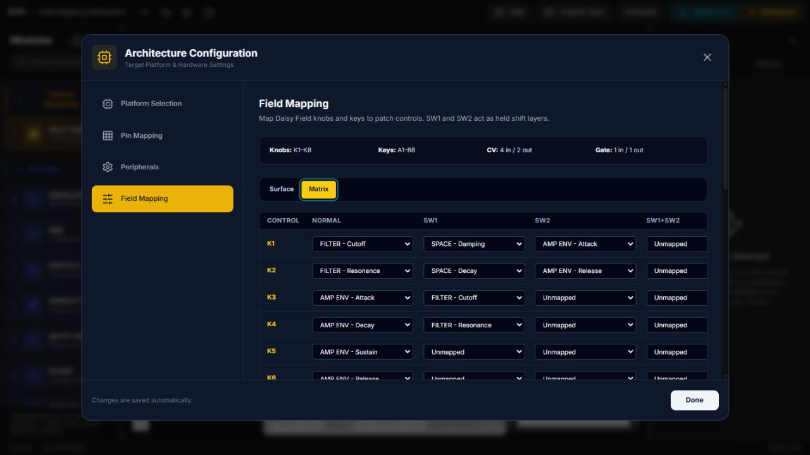

# Tutorial: Daisy Field Mapping

**Goal**: Use the Field Mapping panel to map Daisy Field hardware controls without adding separate knob or key blocks to the graph.

**Example patch**: `dvpe_CLD/examples/field_mapping_subtractive.dvpe`

**Target hardware**: Daisy Field

**Time**: 10-15 minutes

---


*The included seven-block patch uses eight connections and keeps the audio and
control paths visible while hardware mappings remain in Architecture.*

## What This Teaches

The Field Mapping panel maps the fixed Daisy Field surface directly to patch parameters:

- `K1-K8` map to safe numeric parameters.
- `A1-B8` map to gate/trigger input ports or 3-state parameter toggles.
- `SW1` and `SW2` are held shift selectors; short press can also be mapped as an action.
- 3-state key toggles use Field key LEDs: Off, Blinking, On.
- Layers resolve as `SW1+SW2`, then `SW2`, then `SW1`, then `Normal`.
- A graph wire into a target input wins over a mapping.

The example patch is a small subtractive synth:

```text
SOURCE -> FILTER -> AMP VCA -> SPACE -> OUT
              ^        ^
              |        |
        B1 ACCENT   AMP ENV
```

`A1` gates the amplitude envelope. `SW1` short press triggers a short accent envelope into filter drive. `B2` cycles three reverb damping values and shows the selected state on its key LED.

---

## Open The Example

1. Start DVPE:

```bash
cd dvpe_CLD
npm run dev
```

2. Open the app in the browser.
3. Load `dvpe_CLD/examples/field_mapping_subtractive.dvpe`.
4. Open **Architecture**.
5. Select **Field Mapping**.

Open **Surface** for the visual Field layout, or **Matrix** for the full layer table. The matrix shows rows for `K1-K8` and `A1-B8`, with columns for **Normal**, **SW1**, **SW2**, and **SW1+SW2**.



*Surface view follows the physical Field layout and is the quickest place to
assign a single knob or key.*

---

## Normal Layer

Use the Field with no switch held:

| Control | Target |
| --- | --- |
| `K1` | filter cutoff |
| `K2` | filter resonance |
| `K3` | amp attack |
| `K4` | amp decay |
| `K5` | amp sustain |
| `K6` | amp release |
| `K7` | reverb decay |
| `K8` | reverb wet/dry |
| `A1` | amp envelope gate |
| `SW1` short press | filter-drive accent trigger |
| `B2` | 3-state reverb damping toggle |

Hold `A1` to hear the oscillator through the ADSR/VCA. Tap `SW1` to add a short drive accent. Tap `B2` to cycle damping; its LED moves through Off, Blinking, and On.

---

## Held Shift Layers

Hold `SW1` while turning knobs:

| Control | Target |
| --- | --- |
| `K1` | reverb damping |
| `K2` | reverb decay |
| `K3` | filter cutoff, wider performance range |
| `K4` | filter resonance, wider performance range |

Hold `SW2` while turning knobs:

| Control | Target |
| --- | --- |
| `K1` | amp attack, long range |
| `K2` | amp release, long range |

Hold both `SW1` and `SW2`:

| Control | Target |
| --- | --- |
| `K1` | reverb wet/dry |

When a held layer remaps a control, that physical control stops affecting its normal-layer target for that held state. For example, `K1` controls filter cutoff normally, but with `SW1` held it controls reverb damping instead.



*Matrix view makes all four precedence layers visible at once.*

---

## Edit A Mapping

1. In **Architecture > Field Mapping**, find `K3`.
2. In the **Normal** column, select another safe numeric target.
3. Export C++.

The generated Field code reads `SW1` and `SW2` once, computes the active mapping layer, and inserts the selected `hw.GetKnobValue(DaisyField::KNOB_N)` expression into the target parameter setter.

For keys, gate targets use `hw.KeyboardState(index)`. Trigger targets use `hw.KeyboardRisingEdge(index)`.

For `toggle3` keys, code generation creates a persistent three-state value, advances it on `KeyboardRisingEdge(index)`, applies the chosen parameter value, and drives the Field key LED with `hw.led_driver.SetLed(...)`.

---

## Conflict Rule

Do not connect a wire to a mapped target input. A graph connection wins.

Example: if a CV wire is connected to `FILTER.drive_cv`, the Field Mapping panel marks `FILTER - Drive` as connected and prevents assigning a knob to it. If an old patch still contains that stale mapping, code generation returns an error instead of producing ambiguous C++.

---

## Suggested Experiments

1. Map `K5` on `SW2` to `SPACE - Decay` for a second reverb page.
2. Change `B2` to another 3-state target, such as a numeric tone or modulation parameter.
3. Remove the `B1 ACCENT -> FILTER.drive_cv` wire, then map a knob to `FILTER - Drive`.

Keep mappings sparse at first. The useful pattern is: normal layer for performance controls, `SW1` for tone/detail, `SW2` for envelope ranges, and `SW1+SW2` for less common global controls.

## Related Tutorials

- [Build your first patch](../../docs/tutorials/GETTING_STARTED_FIRST_PATCH.md)
- [Inspector, Hardware, and Export](../../docs/tutorials/INSPECTOR_HARDWARE_AND_EXPORT.md)
- [Create and reuse a custom block](../../docs/tutorials/CUSTOM_BLOCKS_AND_REUSE.md)
- [Design modes and visual tuning](../../docs/tutorials/DESIGN_MODES_AND_VISUAL_TUNING.md)
- [Complete Block Diagram and Inspector guide](../../docs/user-guide/BLOCK_DIAGRAM_AND_INSPECTOR_GUIDE.md)
